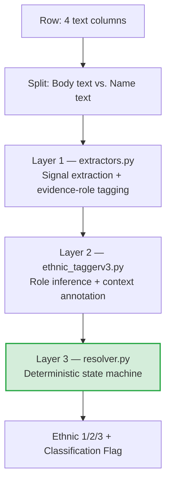

# ECF Classification — AI handoff bundle

This one file contains everything an AI needs to understand this tool and write
documentation for it. It is a GENERATED copy of the project's real documents,
bundled for an assistant that cannot open files on your computer.

**How to use it:** upload this file and paste the prompt below.

---

## The prompt

> Read this whole document first. It contains the brief, the current user
> instructions, the developer documentation, and the file-discovery source code
> for an internal tool called ECF Classification.
>
> Write a user guide for it, following the brief in section 1 ("Brief for
> building a user guide"). The audience is non-technical foundation staff who
> need to run the tool, plus one technical maintainer who looks after it.
>
> Cover: the three ways to run it, the four working folders, which files the
> user supplies and which the tool creates, the six stages in order, the menu,
> and troubleshooting. Explain in plain language what the engine actually does.
>
> Do not restate the case-by-case classification rules in full — summarise them.
> Do not invent features, file names, screenshots, or menu options that are not
> in this document. If something is unclear, list your questions at the end
> rather than guessing.

---

## What is in this bundle

| Section | Source file | Why it is here |
|---|---|---|
| 1 | `Documentation/AI-HANDOFF.md` | The brief. What this project is, how it runs, and the rules an AI must not break. |
| 2 | `HOW TO RUN.md` | The current end-user instructions. The guide you are asked to write replaces or extends this, so read it before writing anything. |
| 3 | `README.md` | Developer documentation: the classification method, the module map (what every file does), and the execution guide. |
| 4 | `Documentation/PROCESS.md` | Reference only. The classification rules case by case, with examples. Use it to understand behaviour -- do NOT restate it in a user guide. |
| 5 | `Engine_1_and_2/paths.py` | Source code, included because it defines the folder and filename convention everything else depends on. |


---

# 1. Documentation/AI-HANDOFF.md

# AI Handoff — Context Pack for an AI Assistant

This file exists so an owner can hand this codebase to an AI assistant (Claude
Code or otherwise) and have it run the engine correctly and write user
documentation, without re-discovering the project from scratch or breaking
anything. Read this file first, then read the files it points at — don't
guess at behaviour this project already documents.

---

## 1. What this project is

This is a deterministic classification pipeline for Edmonton Community
Foundation's discretionary funding-request (FR) data. It reads free-text
fields from a funding-request workbook — project descriptions, purpose,
organization name — and classifies each row along three axes: **ethnic and
cultural origins**, **gender identity**, and **sexual identity**, against a
standardized taxonomy. There is no machine-learning model in the decision
path: every label comes from a rule-based state machine, so the same input
always produces the same output and every decision can be traced to a rule.
A human-review workflow sits on top of the engine so staff can audit and
correct its output before it's treated as final.

---

## 2. Where the truth already lives

Read these before asking questions the docs already answer:

| Source | What it covers |
| :--- | :--- |
| `README.md` sections 1–6 | The classification method: architecture, the three-layer pipeline, the case-by-case logic (Cases 1–13), audit-flag rules, the gender/sexual-identity engines, and why the ML layer is hibernated. |
| `README.md` section 7 | Full module map — every file's purpose — plus the file-discovery convention and how to extend a rule. |
| `README.md` section 8 | Technical execution guide: exact commands, what each script does, which columns get written. |
| `HOW TO RUN.md` | End-user instructions (the three ways to run it, the four folders, the menu, the stages, troubleshooting) and a maintainer section at the bottom (build/Docker/rebuild details). |
| `Documentation/PROCESS.md` | Informal, evolving case-by-case classification notes and examples — the working notes behind the rules in `README.md` section 3. Treat `README.md` as the authoritative current description; `PROCESS.md` is background/history. |
| `Engine_1_and_2/paths.py` | The file-discovery convention, in code, with a docstring explaining *why*: filenames are not code, and renaming a workbook must never require a code edit. Read this before touching anything path-related. |

Do not re-derive the classification rules, the module layout, or the
file-discovery convention from scratch — they are documented and read faster
than they can be reverse-engineered.

---

## 3. How to run it

There are three ways to reach the same numbered menu
(`Maintainer/Tools/launcher.py`):

| Path | Command | Needs |
| :--- | :--- | :--- |
| Built executable | Double-click `ECF Classification.exe` at the repo root | Nothing — no Python, no Docker |
| Local Python | `Maintainer\RUN.bat` | System Python (builds a `.venv` on first run) |
| Docker | `Maintainer\RUN (Docker).bat` or `Maintainer/run-docker.sh` | Docker Desktop running |

Menu options and the scripts behind them:

| Option | Script |
| :--- | :--- |
| 1. Run classification | `Engine_1_and_2/run_all.py` |
| 2. Build review workbook | `Engine_1_and_2/Auditing/generate_review_report.py` |
| 3. Apply my review corrections | `Engine_1_and_2/Auditing/apply_review_corrections.py` (dry run by default; `--apply` writes) |
| 4. Build stakeholder dashboard | `Engine_1_and_2/Auditing/generate_stakeholder_dashboard.py` |
| D | Switch dataset |
| C | Health check (shows what's found/missing) |
| 0 | Exit |

Every engine script can also be run directly and takes no arguments — it
reads/writes the paths `paths.discover()` resolves for the active dataset
(set via the `ECF_DATASET` environment variable, or the first dataset found
alphabetically):

```powershell
python Engine_1_and_2/run_all.py
$env:ECF_DATASET="2023_24"; python Engine_1_and_2/run_all.py
```

For Docker specifically, see the verb-driven non-interactive form in
`HOW TO RUN.md`'s maintainer section (`docker compose run --rm ecf classify`,
etc.) — useful for scripting rather than the interactive menu.

---

## 4. The data model

Four working folders at the repo root, described in full in `HOW TO RUN.md`
("Where the files go" and "What you provide, and what the tool creates"):

| Folder | Contents | Who puts files there |
| :--- | :--- | :--- |
| `Data Sheets/` | Funding-request workbooks to classify, one per year, named `Discretionary Funding Requests - {year}.xlsx` | User supplies |
| `Taxonomy/` | `Taxonomy - Definitions.xlsx` — exactly one file | User supplies |
| `Gold/` | Hand-audited snapshots of past years — optional | User supplies (optional) |
| `Final Review/` | Audited copies corrections get written into | Tool creates on first use of option 3 |

The tool also creates `Data Sheets/Classification Review.xlsx` (option 2) and
`stakeholder_dashboard*.html` (option 4). Nothing else is generated.

The six stages, in order:

1. Put a workbook in `Data Sheets/` (year in the filename) and the taxonomy
   file in `Taxonomy/`.
2. **Option 1 — classify.** Writes ethnic/gender/sexual columns directly into
   the source workbook.
3. **Option 2 — build review workbook.** Creates
   `Data Sheets/Classification Review.xlsx` containing the flagged rows.
4. **Human review.** Staff open that file, type corrections into the
   classification columns, save and close it.
5. **Option 3 — apply corrections.** Shows every cell it will change, waits
   for a typed `YES`, then writes into the year's file in `Final Review/`
   (creating it the first time).
6. **Option 4 — dashboard.** Reads the `Final Review/` copy, so it reflects
   the human corrections.

Dataset matching is by year parsed from the filename — see
`Engine_1_and_2/paths.py` (`dataset_name_from`, `discover`).

---

## 5. Invariants an AI must not break

- **Engines write in place** into the user's own workbook in `Data Sheets/`.
  Never redirect output elsewhere "to be safe" — that breaks the discovery
  convention and orphans the user's data.
- **Excel holds exclusive file locks.** A workbook open in Excel cannot be
  written by the tool (or by you). Always confirm Excel is closed before
  running option 1 or option 3, or any script that writes.
- **Option 3 is the only destructive step.** It previews every change and
  requires the user to type `YES`. Never script around that confirmation or
  auto-supply `YES` on someone's behalf.
- **Never edit files in `Data Sheets/`, `Taxonomy/`, `Gold/`, or
  `Final Review/` directly.** These are the user's data, not project source.
  Reading them to help the user is fine; editing them by hand is not — that's
  what the engine and option 3 are for.
- **Filenames are not code.** Never hardcode a path or a dataset name
  anywhere. Discovery reads the year out of the filename
  (`Engine_1_and_2/paths.py`); a new year's workbook must work with zero code
  changes.
- **Gold is optional.** Never require a `Gold/` file to exist or make it a
  precondition for running anything.
- **No autonomous git.** Do not commit or push in this repo unless the user
  explicitly asks in that moment.
- **Regression-check any engine change.** Before an engine change ships,
  re-run it against the audited gold rows with
  `Engine_1_and_2/Auditing/regression_audited_rows.py` and confirm no
  previously-correct row flips. See `regression_baseline.json` and the
  "Regression discipline" note in `README.md` section 7.
- **The ML layer is hibernated on purpose** (`Engine_1_and_2/Semantic_Engine/`
  — excluded from both the `.exe` build and the Docker image; see `README.md`
  section 6). Do not re-enable it, wire it back into the pipeline, or treat
  its presence in the tree as an invitation to "improve" results with it.

---

## 6. Brief for building a user guide

If asked to write or refresh end-user documentation, treat this section as
the spec.

**Audience:** two readers in one document — non-technical staff running the
tool day-to-day, and a technical maintainer who occasionally rebuilds or
troubleshoots it. `HOW TO RUN.md` already splits this way (staff-facing body,
"For whoever maintains this (technical)" section at the end) — match that
pattern rather than inventing a new structure.

**Must cover:**
- The three ways to run it (executable, `RUN.bat`, Docker) and when each
  applies.
- The four working folders and what belongs in each.
- The six stages, in order, and which menu option maps to which.
- The menu table (options 1–4, D, C, 0).
- Troubleshooting: a file locked by Excel, the SmartScreen warning on first
  run, "NO DATA FOUND" (no dataset in `Data Sheets/`), Docker not running.
- A plain-language explanation of what the engine does — drawn from
  `README.md` sections 2–4 (the three-layer pipeline, signal vs. decision
  separation, the audit-flag philosophy) — described for a non-technical
  reader, not reproduced verbatim.

**Do not:**
- Restate `Documentation/PROCESS.md`'s case-by-case rules in full — link to
  it or summarize in one or two sentences at most.
- Invent screenshots or UI descriptions that aren't verifiable from the code
  or existing docs.
- Change any code, `.bat`/`.sh` script, Dockerfile, or spec file while
  writing documentation. Documentation tasks are read-only with respect to
  everything except the docs themselves.

---

## 7. Ready-to-paste prompts

These are the same prompts offered to end users in `HOW TO RUN.md`'s
"Letting an AI assistant run it for you" section. Reproduced here so this
file is self-contained.

```
Run the classification on my data. First read HOW TO RUN.md and
Documentation/AI-HANDOFF.md so you understand the tool. Confirm with me
which dataset to use, make sure I've closed the workbook in Excel, then run
the classification step (menu option 1 / Engine_1_and_2/run_all.py) and
show me the summary counts afterwards. Don't change any code.
```

```
Take me through the whole review cycle: run classification, build the
review workbook, tell me where to make my corrections, then apply them and
build the dashboard. Stop and explain each stage before moving to the next.
Don't change any code.
```

```
Build or refresh the stakeholder dashboard for my current dataset. Tell me
where the HTML file ends up. Don't change any code.
```

```
Explain what the engine did with a specific funding request — [describe or
paste the row]. Walk me through which text triggered which rule, and
whether it was flagged for review. Don't change any code.
```

```
Write or refresh the user guide for this tool, using
Documentation/AI-HANDOFF.md as the spec for what it must cover. Don't
change any code.
```


---

# 2. HOW TO RUN.md

# How to run this tool

You do not need to know anything about code to use this.

## Starting it

**Double-click `ECF Classification.exe`.** That's it — nothing to install, no
Python, no Docker, no admin rights needed. A window opens with the numbered
menu described below. Type a number, press Enter.

> **Windows may warn you first.** Because this is a new, unsigned program,
> Windows SmartScreen can show a blue box saying "Windows protected your PC".
> This is expected for a small in-house tool — it isn't a sign anything is
> wrong. Click **"More info"**, then **"Run anyway"**. You only need to do
> this once per computer.

That's the whole setup. Everything below — where the files go, the menu, the
working order — applies exactly the same whether you're running the `.exe` or
one of the alternatives further down.

## Where the files go — the tool creates these for you

**The first time you run it, it creates a folder called `ECF Classification`
on your Desktop**, containing the four folders it needs and a
`START HERE.txt`:

```
Desktop/ECF Classification/
    START HERE.txt
    Data Sheets/     README.txt
    Taxonomy/        README.txt
    Gold/            README.txt
    Final Review/    README.txt
```

**Every one of those folders has a README.txt inside it** explaining exactly
what files belong there, how to name them, and what the tool does with them.
Open the README in a folder whenever you're unsure — it's written for exactly
that moment. They open in Notepad with a double-click.

In short:

| Folder | What belongs in it |
|---|---|
| **Data Sheets** | The funding-request workbooks to classify. One per year. |
| **Taxonomy** | `Taxonomy - Definitions.xlsx`. Just that one file. |
| **Gold** | Hand-audited snapshots of past years, if you have any. Optional. |
| **Final Review** | The audited copies your corrections get written into. |

The tool tells you where these folders are when it makes them, and option **C**
on the menu shows you the location again at any time.

**Name each new workbook with its year:**

```
Discretionary Funding Requests - 2026.xlsx
```

That's the only rule. The tool reads the year from the filename, calls that
dataset `2026`, and automatically pairs it with anything else carrying 2026 —
its GOLD file in `Gold`, its copy in `Final Review`. Next year, drop in
`... - 2027.xlsx` and it appears in the menu on its own.

A dataset works fine before its GOLD and Final Review files exist — you do not
need to create either by hand. The health check (option C) shows `(none yet)`
for whatever is still missing.

Your READMEs are never overwritten, so any notes you add to them are safe.

> **Already set up?** If the tool folder itself already contains a `Data Sheets`
> folder with workbooks in it, the tool keeps using those and does **not** create
> anything on your Desktop. Existing installations carry on unchanged.

## What you provide, and what the tool creates

Only **two** files are ever created that you didn't supply. Everything else is
written *into* workbooks you provided — which is why the tool asks you to close
Excel first.

**You provide:**

| File | Goes in | Needed |
|---|---|---|
| `Discretionary Funding Requests - 2026.xlsx` | `Data Sheets/` | Always — this is the workbook being classified |
| `Taxonomy - Definitions.xlsx` | `Taxonomy/` | Always — nothing runs without it |
| `FR - 2026 (GOLD-AUDIT).xlsx` | `Gold/` | Optional. Only if you already have a hand-audited snapshot of that year |

**The tool creates:**

| File | Made by | Where |
|---|---|---|
| `Classification Review.xlsx` | Option 2 | `Data Sheets/` |
| `...2026... (GOLD) Final review.xlsx` | Option 3, the first time | `Final Review/` |
| `stakeholder_dashboard_2026.html` | Option 4 | `Data Sheets/` |

### The stages, in order

1. **Put your workbook in `Data Sheets/`** with the year in its name, and make
   sure `Taxonomy - Definitions.xlsx` is in `Taxonomy/`.
2. **Option 1 — Run classification.** Fills the ethnic, gender and sexual
   columns **into your workbook**. Nothing new appears.
3. **Option 2 — Build review workbook.** Creates
   `Data Sheets/Classification Review.xlsx`, containing the rows the engine
   flagged. Built from that year's GOLD file if you have one; otherwise from the
   workbook you just classified.
4. **You review.** Open `Classification Review.xlsx`, type your corrections into
   the classification columns, save and close it.
5. **Option 3 — Apply my review corrections.** Shows every cell it would change
   and waits for you to type `YES`. It writes into that year's file in
   `Final Review/`, **creating it for you** the first time. Your original
   workbook is left exactly as the engine wrote it.
6. **Option 4 — Build stakeholder dashboard.** Reads the `Final Review/` copy,
   so the dashboard reflects your corrections.

Steps 2 to 6 can be repeated as often as you like. Re-running step 1 is always
safe: it only ever touches the workbook in `Data Sheets/`, never your
corrections in `Final Review/`.

## Before you run anything: close Excel

If a workbook is open in Excel, this tool cannot save to it. This applies no
matter how you're running the tool. The menu checks for this and will tell
you which file to close. Just close it and try again.

## The menu

| Option | What it does |
|---|---|
| **1. Run classification** | Reads the funding-request workbook and fills in the ethnic, gender and sexual-identity columns. Takes a few minutes. |
| **2. Build review workbook** | Creates `Data Sheets/Classification Review.xlsx` — the file you type your corrections into. Changes no gold file. |
| **3. Apply my review corrections** | Copies your corrections from that review workbook into the Final Review files. Shows you everything it will change first, and asks before writing. |
| **4. Build stakeholder dashboard** | Produces the dashboard `.html` file in `Data Sheets`. Open it in a browser. |
| **D. Switch dataset** | Cycles through the datasets found in `Data Sheets`. The header always shows which one you're on. |
| **C. Check everything is set up** | Confirms the required files are present and nothing is open in Excel. Run this first if something seems wrong. |

## The normal working order

1. **Option 1** — run the classification.
2. **Option 2** — build the review workbook.
3. Open `Data Sheets/Classification Review.xlsx` and type your corrections
   directly into the classification columns. Save and close it.
4. **Option 3** — apply those corrections. Read the list it shows you, then type
   `YES` to write them.
5. **Option 4** — build the dashboard, if you need it.

## Letting an AI assistant run it for you

Everything above works fine with just the `.exe` and a mouse — this section
is for people who'd rather type what they want in plain language than click
through the menu. It's an **alternative**, not a requirement.

### What you need first

1. **Get this whole folder onto your computer** — the same one you'd use to
   run `ECF Classification.exe`. Nothing in it needs to change.
2. **Install Claude Code**: <https://claude.com/claude-code>. Claude Code is
   a separate paid tool from Anthropic, run from a terminal (or from inside
   VS Code) — it is not part of this project and isn't required to use the
   `.exe`. Follow Anthropic's install instructions for your computer.

### How to start it

Open a terminal (or VS Code's terminal panel) **in this folder** and run:

```
claude
```

That drops you into a conversation. From there, describe what you want, or
paste one of the prompts below.

### Ready-to-paste prompts

Copy one of these into the terminal exactly as written.

**Run the classification:**
```
Run the classification on my data. First read HOW TO RUN.md and
Documentation/AI-HANDOFF.md so you understand the tool. Confirm with me
which dataset to use, make sure I've closed the workbook in Excel, then run
the classification step (menu option 1 / Engine_1_and_2/run_all.py) and
show me the summary counts afterwards. Don't change any code.
```

**Take me through the whole review cycle:**
```
Take me through the whole review cycle: run classification, build the
review workbook, tell me where to make my corrections, then apply them and
build the dashboard. Stop and explain each stage before moving to the next.
Don't change any code.
```

**Build the dashboard:**
```
Build or refresh the stakeholder dashboard for my current dataset. Tell me
where the HTML file ends up. Don't change any code.
```

**Explain a specific request:**
```
Explain what the engine did with a specific funding request — [describe or
paste the row]. Walk me through which text triggered which rule, and
whether it was flagged for review. Don't change any code.
```

**Write or refresh the user guide:**
```
Write or refresh the user guide for this tool, using
Documentation/AI-HANDOFF.md as the spec for what it must cover. Don't
change any code.
```

### A safety note

An AI assistant can read and write files just like you can, so the same
rules from earlier in this document still apply: **close Excel first**, and
remember that applying your review corrections (option 3) writes into the
`Final Review/` copies — read what the assistant proposes to change before
you approve it, the same way you'd read option 3's own confirmation list.

## If something goes wrong

The window tells you what happened in plain language.

| Symptom | What it means | What to do |
|---|---|---|
| Blue "Windows protected your PC" screen | SmartScreen warning about a new, unsigned program. Expected. | Click "More info", then "Run anyway". Only needed once per computer. |
| A file is open in Excel | The tool cannot write to a file Excel has locked. | Close it, try again. |
| "NO DATA FOUND" | No workbook in `Data Sheets`, or it isn't named with a year. | Put one there, named e.g. `Discretionary Funding Requests - 2026.xlsx`. |
| A file was renamed or moved | The tool expected an exact file it can't find. | Put it back, or pass the message to whoever maintains the tool. |
| Antivirus quarantined or deleted the `.exe` | Some antivirus tools are suspicious of new, unsigned, single-file programs. | Restore it from quarantine and add an exception, or ask IT to allow it. Re-download/re-copy the file if it was deleted outright. |

Nothing is written unless a step succeeds completely, and option 3 always shows
you the full list of changes before it writes anything. If you're unsure, press
Enter to cancel — cancelling never changes a file.

If you see a message ending in "Send this message to whoever maintains the
tool", take a photo or screenshot of the window. That message contains what's
needed to diagnose it.

---

## For whoever maintains this (technical)

Everything in this section lives in the **`Maintainer/`** folder — it holds
the build and container tooling, not anything a non-technical user opens.

Day-to-day use for non-technical staff is **`ECF Classification.exe`** (at
the top level of the folder, beside `Data Sheets/` etc.), built by
`Maintainer\build-exe.bat` (PyInstaller, spec file
`Maintainer\ECF Classification.spec`) straight from
`Maintainer\Tools\launcher.py`. It's a single onefile executable with
`Engine_1_and_2/` bundled in as data; PyInstaller extracts it to a temp dir
(`sys._MEIPASS`) at startup. Frozen, `sys.executable` is the `.exe` itself, so
`launcher.run()` re-invokes it with an internal `--run-script <path>` flag
(handled in `main()` via `runpy.run_path`) instead of trying to shell out to a
Python interpreter that doesn't exist standalone — each engine step still runs
as its own subprocess, exactly as it does unfrozen. `Engine_1_and_2/paths.py`
has a matching frozen-mode adjustment: the "does an install already have data
sitting next to it" check looks at the folder the `.exe` lives in
(`paths.tool_dir()`), not the temp extraction dir.

To rebuild after a code change: run `Maintainer\build-exe.bat` (needs `.venv`
already set up — run `Maintainer\RUN.bat` once first if not). It builds from
the repo root (the .bat `cd`s there first, since `.venv` and `Engine_1_and_2`
live there) and, on success, copies the result from `dist\ECF Classification.exe`
to `ECF Classification.exe` at the top level of the folder — overwriting any
previous copy — ready to hand to staff or drop straight into SharePoint. If a
rebuilt exe fails at runtime with "No module named X", add X to
`hiddenimports` in `Maintainer\ECF Classification.spec` and rebuild — the
engine scripts are loaded at runtime via `runpy`, so PyInstaller can't see
their imports statically. The ML layer (`torch`, `sentence_transformers`,
`faiss`, etc.) is deliberately excluded — it was removed from the pipeline
and is ~1 GB of packages the classification path never uses.

Two other ways to run this remain, for the maintainer:

**Docker** — for reproducible or server-side runs. `Maintainer\RUN (Docker).bat` /
`Maintainer/run-docker.sh` → `docker run -it --rm -v "<workspace>:/data"
ecf-discretionary-fr:latest`, which drops straight into
`Maintainer\Tools\launcher.py` (the same menu the `.exe` gives). Both scripts
`cd` to the repo root first, so the build context is still the whole project.
The image separates code from data: code lives at `/app` (`Engine_1_and_2/`
and `Tools/`, baked in at build time from `Maintainer/Tools/`), and the
workspace — `Data Sheets/`, `Taxonomy/` and `Final Review/` — is
bind-mounted at `/data` at run time, with `ECF_WORKSPACE=/data` set so
`paths.py` resolves straight to the mount. Only `requirements.txt` is
installed — the ML extras in `requirements-ml.txt` are excluded on purpose.

**`RUN.bat`** — for a maintainer's machine that already has Python. Identical
menu, no packaging step; the very first run installs the project's own
`.venv`. If it says Python is not installed, install it from python.org and
tick "Add python.exe to PATH" on the installer's first screen.

None of these three paths add classification logic of their own — they all
shell out to the same entry points and set `ECF_DATASET`, so the engines
remain independently runnable:

```
python Engine_1_and_2/run_all.py
python Engine_1_and_2/Auditing/generate_review_report.py
python Engine_1_and_2/Auditing/apply_review_corrections.py [--apply]
python Engine_1_and_2/Auditing/generate_stakeholder_dashboard.py
```

Verb-driven, non-interactive runs still work for scripting or CI, via either
`docker run` or `docker compose` (run from the repo root, or adjust the `-f`
path accordingly):

```
docker build -t ecf-discretionary-fr -f Maintainer/Dockerfile .
docker compose -f Maintainer/docker-compose.yml build
docker compose -f Maintainer/docker-compose.yml run --rm ecf help
docker compose -f Maintainer/docker-compose.yml run --rm ecf classify
docker compose -f Maintainer/docker-compose.yml run --rm ecf preview
docker compose -f Maintainer/docker-compose.yml run --rm -e ECF_DATASET=2023_24 ecf dashboard
```

`docker compose` builds with the repo root as context (`context: ..` in
`Maintainer/docker-compose.yml`, since the file itself lives one level down)
and mounts `${ECF_WORKSPACE_HOST:-..}` (the repo root, by default) at `/data`
— set `ECF_WORKSPACE_HOST` to point it at a different workspace.
`Tools/docker_entrypoint.py` runs with no arguments in two ways: with an
interactive terminal attached (`docker run -it`, which the host launchers
use) it hands off to the menu; without one, it prints the help text instead
of hanging on an `input()` nobody can answer.

Note that Excel's file locks apply to the container too: close the workbooks
before any command that writes.

### If the `.exe` ever stops being allowed

Distributing this as an `.exe` through SharePoint depends on a Microsoft 365
tenant policy that can change — most often when IT tightens the rules on
unsigned executables. Nothing about the tool depends on that policy: the `.exe`
is a convenience for staff, not the product. Everything needed to run or
rebuild it ships in this folder.

If staff suddenly cannot download or run `ECF Classification.exe`:

| Fallback | What it costs |
|---|---|
| **Get it code-signed** by IT and carry on as before | The most durable fix — blocking policies almost always target *unsigned* executables, and signing also removes the SmartScreen warning for good. Ask whether IT already holds a signing certificate; many do. |
| **Put the `.exe` on a network share** instead of SharePoint | Nothing changes for staff except where they get the file. Files run from an internal share usually aren't web-marked either, so the SmartScreen warning goes away too. |
| **Zip it** and upload that | Often permitted where a bare `.exe` isn't. Staff right-click → "Extract All" before double-clicking. |
| **Skip the `.exe` entirely** — `Maintainer\RUN.bat` | Identical menu, but each machine needs Python installed. Fine for one or two people, poor for a whole team. |

Rebuilding the `.exe` at any time is `Maintainer\build-exe.bat` on a machine
with the project's `.venv` set up. That is the only step that needs a
technical person, and it takes about two minutes.


---

# 3. README.md

# Technical Project Report & Developer Documentation: Automated Ethnic, Gender & Sexual Identity Classification Pipeline

---

## 1. Executive Summary & Intent

### Project Overview
This project is an automated data pipeline that parses, analyzes, and classifies funding request (FR) data. By extracting narrative indicators from grant descriptions, the system populates three classification axes against the standardized frameworks in `Taxonomy - Definitions.xlsx`:

1. **Ethnic & Cultural Origins** (`Ethnic 1/2/3 - FR6/7/8`)
2. **Gender Identity** (`Gender Id - FR9`)
3. **Sexual Identity** (`Sexual Id - FR10`)

Every classification is accompanied by a **Classification Flag** column that preserves the evidence and any review notes for human auditors.

### Developer Intent & Philosophy
The codebase is built for **modularity**, **determinism**, and **auditability**. It eliminates manual classification variance while staying flexible enough to adjust rules as community demographic landscapes evolve.

The central design decision is a **strict separation between signal detection and decision-making**. Extractors are "dumb sensors" that surface every possible match; a single deterministic **state-machine resolver** makes every classification decision. No probabilistic model is in the shipping path — machine-learning components exist in the tree but are **hibernated / advisory-only** (see ->6). This keeps the engine fully reproducible and testable: the same row always produces the same label, and every decision can be traced to a rule.

---

## 2. Core Architecture & Process Flow

The ethnic engine is a **three-layer deterministic pipeline**. Each layer has one job and does not reach into the others:



Orchestration lives in `classify_pipeline.py`, which contains **no classification logic** — it only wires the layers together. All ethnic-origin decisions live in `resolver.py`.

### Step 1 — Ingestion & Text Prioritization
The pipeline reads the active dataset's workbook (see ->7 — dataset switching) and builds a hierarchical taxonomy dictionary from `Taxonomy - Definitions.xlsx`, parsing column D **"All Terms"** (Level 1 + Level 2 + Level 3 concatenated with the literal word `Origins` as delimiter), falling back to the individual Level 1/2/3 columns if that cell is blank. Entries are sorted **deepest-first, then longest-keyword-first** so that "Southern and East African" is captured before the broader "African".

The four input columns are split into two groups:

| Group | Columns | Role |
| :--- | :--- | :--- |
| **Body** (served-population evidence) | `Final_Project_Description`, `Final_Summary_Description`, `Purpose` | A signal here can classify a row. |
| **Name** (organization / request title) | `Funding Request Name` | Consulted only for a curated known-org lookup and to decide whether a *name-only* signal should be flagged. |

**Corroboration rule:** a signal must appear in the **body** to classify. A signal that appears **only in the name** degrades to `General Population` with an explanatory flag — unless a curated known-org lookup or the silent-body name rule applies (see ->4).

### Step 2 — Layer 1: Signal Extraction (`extractors.py`)
Six extractor functions scan the text and emit **one candidate per occurrence** of a match. They perform **no filtering, no negation guards, and no suppression** — every match becomes a candidate:

- `extract_taxonomy_candidates` — direct taxonomy keyword hits (Cases 1–3)
- `extract_pattern_candidates` — structured/directional phrases, e.g. "North African", "South Asian", plus Indigenous terms (Case 4)
- `extract_country_candidates` — demonyms and "from &lt;country&gt;" phrasing via the supplementary country map (Cases 6–7)
- `extract_compound_candidates` — dual-identity phrases like "Afro-Caribbean" (expands into two group candidates)
- `extract_broad_identity_candidates` — broad labels like "multiracial", "mixed heritage" (Case 9b)
- `extract_org_candidates` — curated known-organization lookup (Case 10, name-only, last resort)

Each candidate carries `{level1, level2, level3, depth, source, role, self_id, span, context}`.

### Step 3 — Layer 2: Evidence-Role Inference & Context Annotation (`ethnic_taggerv3.py`)
This is the heart of the current engine. Every extracted match is assigned an **evidence role** based on the words immediately surrounding it (`infer_role`). The role decides whether a match counts as real evidence of who is served:

| Role | Meaning | Counts as served? |
| :--- | :--- | :--- |
| `served` | Default — the group is stated as the served population. | ✅ Yes |
| `served_self_id` | Group counts as served only because the org named/described **itself** (org-name echo or copula self-description, e.g. "…is the only Indigenous Artist-Run Centre"). Normalized back to `served` but tracked via `self_id=True` so the row is still flagged. | ✅ Yes (flagged) |
| `topic_keep` | *(Indigenous-only)* Indigenous knowledge/art/practice used as program content, or an Indigenous nation named as an active partner. Kept as served, but adds a verify flag when no plain-served mention also exists. | ✅ Yes (flagged) |
| `org_name` | The term is a **third-party** organization's name ("in partnership with the &lt;Ethnicity&gt; Council"). | ❌ Weak |
| `provider` | The group is named as the service **provider**, not the recipient. | ❌ Weak |
| `example` | Mentioned as an example ("such as…", "including…"). | ❌ Weak |
| `aspirational` | Future/aspirational reach ("hoping to expand to…"). | ❌ Weak |
| `topic` | A curriculum topic, a story/festival setting, or an allyship/reconciliation frame — not a served population. | ❌ Weak |

**Key architectural invariant:** negation and historical/expansion framing are **NOT roles** — they never suppress a candidate. They are surfaced as *annotation flags only*, so a reviewer can judge them. This keeps classification decisions independent of soft discourse signals.

This layer also computes context signals (`extract_context_signals` → `build_context_notes`; production emits negation only), BIPOC detection (`is_bipoc_real_target`), identity-phrase rewrites (e.g. "African Canadian" → "black"), the silent-body name rule, and the Case 13 ethnocultural-org-name safety net.

### Step 4 — Layer 3: The Resolver State Machine (`resolver.py`)
A single deterministic function, `resolve(states, context_flags, bipoc_present)`, makes **every** ethnic decision. Its constraints are strict: context flags may only be **appended** to the output flag string — they **never** influence which branch fires. Decision order:

1. **BIPOC present** → `Multiple Ethnic and Cultural Origins` (unless exactly one specific group is also named, in which case it classifies *as that group* with a low-priority verify note).
2. **No served candidates** → org-lookup fallback, else name a weak-only mention in a transparency note, else `General Population`.
3. **Black + Indigenous co-present** → BIPOC / `Multiple`; **Black + African** or **Black + Caribbean** → `Multiple`.
4. **Two or more distinct Level 1 groups** → `Multiple`.
5. **Single Level 1 group** → resolve to the **deepest level all candidates agree on** (L3 → L2 → L1), dropping bare-umbrella entries when a specific sub-group exists. Indigenous umbrella + two-or-more distinct sub-groups rolls up to L1 with a review flag.

A crucial helper, `dedup()`, collapses candidates that resolve to the same (L1, L2, L3) and performs **evidence-role rescue**: if *any* occurrence of a group was `served`, that group counts as served even if other occurrences were weak.

---

## 3. Granular Case Analysis

The business logic handles these structural scenarios discovered in the funding-request data:

| Case | Category | Analytical Approach | Operational Example |
| :--- | :--- | :--- | :--- |
| **Case 1** | **Exact Match** | Direct keyword alignment with deepest taxonomy terms (Level 3). | "Somali youth", "Punjabi community", "Cree families" |
| **Case 2** | **Level 2 Match** | Text aligns with a subregional classification. | "East African students", "South Asian population" |
| **Case 3** | **Level 1 Match** | Text aligns only with a broad continental category. | "African communities", "Asian families" |
| **Case 4** | **Structured Phrase** | "Modifier + Parent" directional patterns missing from taxonomy text. | "South African", "West African", "North African" |
| **Case 5** | **Taxonomy Country** | Country/nationality demonyms present in the taxonomy. | "Kenyan", "Ethiopian", "Haitian" |
| **Case 6** | **Non-Taxonomy Country** | Valid demonyms absent from the taxonomy, resolved via the country map. | "Jamaican", "Trinidadian", "Brazilian" |
| **Case 7** | **Country Structure** | Explicit country names inside narrative phrases. | "People from Jamaica", "Youth from India" |
| **Case 8** | **Multiple Groups** | Distinct L1 (or tied L2) cohorts → `Multiple`. Same-L1 groups collapse to the shared level. | "African and Caribbean youth" → Multiple; "Indian and Pakistani" → South Asian |
| **Case 9** | **BIPOC (context-aware)** | BIPOC alone → Multiple; BIPOC + one group → that group (flagged). | "BIPOC and Asian" |
| **Case 9b** | **Broad Identity Labels** | Overarching social/cultural descriptors → Other Ethnic and Cultural Origins. | "multiracial", "mixed heritage" |
| **Case 10** | **Organization Lookup** | Curated known-org name → inferred identity; last resort, name-only. | Curated Indigenous-serving org → North American Indigenous Origins |
| **Case 11** | **Ambiguous Equity Markers** | "Grassroots"/"marginalized"/"racialized"/"multicultural" never classify alone; caller flags either way. | "grassroots" + ethnic keyword vs. bare "grassroots" |
| **Case 12** | **General / Catch-all** | Fallback when no served ethnic signal exists. | "All communities", "Open to everyone" |
| **Case 13** | **Ethnocultural Org Name (safety net)** | Low-recall, high-precision: only fires when a row would otherwise be General with zero candidates; flags a possible ethnocultural org name in the title. **Never classifies** — review flag only. | An unrecognized "&lt;Group&gt; Cultural Society" in the title |

---

## 4. Advanced Governance & Audit Flagging

### Name-vs-Body Corroboration & the Silent-Body Name Rule
Because a signal must be corroborated in the body, a row whose **body carries no served signal** is handled specially:

- **Known org** in the name → curated lookup classifies it.
- Otherwise, the **silent-body name rule** (`classify_from_raw_name`) reads identity terms from the raw account name — but only when the body genuinely names no population on *any* axis (`body_names_a_population` guard) and no identity-expansion disclaimer is present. Religion-only or language-only names ("Islamic Missionary Association", "French Canadian Association") resolve to General with a targeted note rather than guessing an ethnicity.
- A name-derived classification is **always flagged** (`SILENT_NAME_FLAG` / `SELF_ID_FLAG`) so a reviewer knows the label was inferred from the org's identity, not stated.

### Self-Identification
An ethnicity-named org naming its **own** ethnicity is treated as evidence of who it serves (`served_self_id`), including orgs named in an Indigenous language that describe themselves ("…is the only Indigenous Artist-Run Centre"). Third-party org names ("in partnership with the &lt;Ethnicity&gt; Council") are still demoted.

### Context Override (Historical vs. Active Targets)
The engine detects historical anchors (`Historically`, `Formerly`, `Previously`, `Originally`, `Founded`, `Established`, `Was/Were`, …) and scope-expansion signals (`Expanding beyond`, `Regardless of ethnic background`, `Irrespective of…`). These are **annotation-only** — they surface a flag but, per the architectural invariant, never suppress a candidate on their own. They demote a match only indirectly, when they coincide with an org-name echo.

### French / Language-Accommodation Filter
When text signals language accommodation ("french-speaking", "in French and English", "official-language minority", "francophone") **and** does not match an ethnic keep-pattern ("French Canadian Association", "Francophone Cultural Society"), French/European ethnic candidates are dropped and a verify note is added — preventing spurious `Multiple` when language access co-occurs with a real ethnic group.

### High-Priority Audit Flags

> [!IMPORTANT]
> **Transparency Rule:** Whenever a flag is triggered, the system preserves the targeted phrase/evidence and writes it into the **Classification Flag** column for human review.

- **BIPOC & Intersections:** `BIPOC`, `QTBIPOC`, `BPOC`, `People of Colour` are context-checked (example/negation/"the BIPOC Grant" program-name uses are skipped). BIPOC alongside exactly one specific group classifies as that group with a low-priority note.
- **Ethnocultural Normalization (identity-phrase rewrites):** `Black Canadian` / `African Canadian` → normalized so downstream matching handles them consistently; `Afro-Caribbean` → `Multiple` (Black + Caribbean); `Cultural Association` mentions are flagged ("verify named group manually").
- **Implicit General Signals:** `Marginalized`, `Multicultural`, `Ethnocultural`, `Racialized`, `Grassroots`, `Immigrant`, `Refugee` without a specific ethnic qualifier default to `General Population` but trigger an audit flag.
- **Indigenous:** general Indigenous terms and Treaty 6/7/8 markers route to `North American Indigenous Origins`. The engine deliberately **over-flags** Indigenous mentions (topic_keep, umbrella-vs-sub-group ambiguity) rather than risk a silent miss.
- **Emphasis & Religion cues:** "especially"/"particularly" near a matched group, and "Hindu" (may imply South Asian/Indian), are surfaced as verify notes on non-General rows.

---

## 5. The Gender & Sexual Identity Engines

`Gender_SexID.py` adds two more axes, reusing the same body/name split and text helpers from `ethnic_taggerv3.py`:

- **Gender Identity** (`Gender Id - FR9` + `Gender Classification Flag`): extracts gender terms from the body; `0` keys → General, `1` → that group (Women/Girls, Men/Boys, Two-Spirit, Other), `2+` → Multiple Gender Identities. A name-only signal degrades to General + org-name flag.
- **Sexual Identity** (`Sexual Id - FR10` + `Sexual Classification Flag`): any guarded body signal → `2SLGBTQIA+`, else General.

Both share the silent-body name rule and family-context guards (so an incidental "fathers"/"sons" mention doesn't misclassify). All labels, patterns, and flag strings live in `gender_constants.py`.

---

## 6. Machine Learning: Hibernated / Advisory-Only

> [!WARNING]
> **The ML layers are NOT in the shipping classification path.** The deterministic rule engine is the sole authority on every label.

Two ML/semantic components exist but do not decide classifications:

1. **Semantic taxonomy suggestion** (`Semantic_Engine/semantic_fallback.py`): a local sentence-embedding model (MiniLM) that, **only for rows the deterministic engine resolved to `General Population`**, suggests the nearest taxonomy entry above a similarity+margin threshold. It never overrides or auto-writes an `Ethnic 1/2/3` result, because embeddings don't understand negation or context override. **Archived 2026-07-29:** this path is no longer imported or run by the pipeline — `ethnic_taggerv3` no longer wires it in and writes no semantic column; `semantic_fallback.py` remains under `Semantic_Engine/` for reference only.

    > **Column note:** the review column this originally populated (`OUTPUT_SEMANTIC = "Semantic Suggestion (REVIEW)"` in code) was manually repurposed in the workbook into a human-review/correction column titled **"Classification Accuracy (Corrected in Different Areas)"**. The engine now *reads* that same column as its **stakeholder-reviewed gate** (`STAKEHOLDER_REVIEWED_COL`): any row a human has marked there is skipped by the NLI role arbiter so it can never second-guess a human-confirmed decision. (The old `OUTPUT_SEMANTIC` constant and its column-write were removed when the semantic path was archived, so nothing re-creates the old header anymore.)

2. **NLI role arbiter** (`Semantic_Engine/ml_arbiter.py`, wired in `classify_pipeline.apply_ml_role_arbiter`): a vendored cross-encoder that can offer a second opinion on `served` role frames. It is **off by default** (`USE_ML_ROLE_ARBITER=1` to A/B test), is **advisory-only** (attaches a verify note, never changes `role` or any label), and skips stakeholder-reviewed rows entirely.

The ML training/calibration scripts have been archived (`Auditing/archive/`). Requirements for the ML layer are isolated in `Maintainer/requirements-ml.txt`; the default `Maintainer/requirements.txt` excludes them to keep the install lean.

---

## 7. Codebase Architecture & Extensibility Guide

### Top-Level Layout
The repo root was reorganized so a non-technical staff member never has to look past the top:
```
ECF Classification.exe      # what staff double-click (built by Maintainer/build-exe.bat)
START HERE.txt              # first-run orientation, auto-created in the workspace
HOW TO RUN.md               # staff-facing run instructions
Data Sheets/                # funding-request workbooks to classify (see "How Files Are Found" below)
Taxonomy/                   # the taxonomy definitions workbook only
Gold/                       # audited GOLD snapshots (optional; was Taxonomy/)
Final Review/                # hand-audited copies corrections are written into
Engine_1_and_2/              # the classification engine (this section)
Documentation/, Plan Files/  # project notes, unrelated to runtime
Maintainer/                  # build/deploy tooling — not needed to just run the tool
```
`Maintainer/` holds the `Dockerfile`, `docker-compose.yml`, `build-exe.bat`, the PyInstaller
`ECF Classification.spec`, `RUN.bat`, the `RUN (Docker).bat` / `run-docker.sh` launchers,
`Tools/` (the actual entry-point scripts the launchers invoke), and the `requirements*.txt`
files.

### Module Map
```
Engine_1_and_2/
├── run_all.py                       # Single entry point — runs all engines in order
├── bootstrap.py                     # sys.path setup, dataset resolution, UTF-8 stdout
├── paths.py                         # File-discovery convention (see "How Files Are Found" below)
├── safe_save.py                     # Atomic workbook save (temp file + os.replace) so an
│                                     # interrupted write can never truncate the target workbook
├── dataset_config.py                # Reshapes paths.discover() into the config dict engines read
├── test_classify_pipeline.py        # Unit tests for the resolver/pipeline decision logic
├── Pipeline/
│   ├── classify_pipeline.py   # Orchestration only — wires the 3 layers
│   ├── extractors.py          # Layer 1 — signal extraction + role tagging
│   ├── ethnic_taggerv3.py     # Layer 2 — role inference, context, I/O, main()
│   ├── resolver.py            # Layer 3 — deterministic state machine (all decisions)
│   └── Gender_SexID.py        # Gender + sexual identity engines
├── Constants/
│   ├── constants.py           # Ethnic patterns, country map, org map, phrase lists
│   └── gender_constants.py    # Gender/sexual labels, patterns, flags
├── Semantic_Engine/                  # Hibernated ML — NOT in the live path (see ->6)
│   ├── semantic_fallback.py         # Embedding-similarity General-Population suggester (archived)
│   ├── ml_arbiter.py                # NLI role arbiter — advisory-only, off by default
│   ├── knn_gold.py                  # kNN transfer over the audited gold rows — advisory-only, measured 51.9% LOO accuracy vs. 98.4% for the rule engine, not wired in
│   ├── vendor_models.py             # One-time offline download/manifest of the two ML models
│   └── diagnose_semantic_scores.py  # Diagnostic: prints raw embedding similarity scores
└── Auditing/
    ├── generate_review_report.py         # Menu option 2. Builds Data Sheets/Classification Review.xlsx — one sheet per dataset, the flagged rows of that dataset's gold sheet plus a computed evidence column. Read-only.
    ├── apply_review_corrections.py       # Menu option 3. Diffs Classification Review.xlsx against the Final Review copies and writes only the changed classification/audit cells. Dry-run by default; `--apply` writes.
    ├── generate_stakeholder_dashboard.py # Menu option 4. Builds a self-contained HTML dashboard (equity lens + engine QA lens) into Data Sheets/stakeholder_dashboard.html. Read-only.
    ├── build_flag_review_column.py       # Not menu-wired. Adds a "Flag Review (keep/drop/merge)" column of KEEP/DROP recommendations to the live workbook. `--dry-run` prints a tally only; `--out` overrides the output path. Backs up the workbook before writing.
    ├── audit_evidence.py                 # Not menu-wired; imported as a library. Read-only evidence explainer — re-scans a row and reports which terms matched, in which column, and whether a guard suppressed them. Never classifies.
    ├── regression_audited_rows.py        # Not menu-wired. Regression guard against AUDITED_FR_GOLD.xlsx. `--snapshot` records the current baseline; run with no args to compare against it and gold, non-zero exit on regression.
    └── archive/                           # Superseded ML calibration/regression scripts, kept for reference only

Maintainer/Tools/
├── launcher.py                # The numbered menu behind RUN.bat / the .exe — see the menu-option mapping above
└── docker_entrypoint.py       # Container entry point; maps short commands (classify/review/preview/apply/dashboard) onto the same scripts, or hands off to launcher.py's menu when run interactively
```

### Dataset Switching
`paths.discover()` in `paths.py` is the single source of truth for which workbooks exist — it scans `Data Sheets/`, `Taxonomy/`, `Gold/` and `Final Review/` and matches partners by the year in their filenames (see "How Files Are Found" below). `dataset_config.py` does not discover anything itself; it just reshapes what `paths.discover()` found into the `{name: config_dict}` shape the engines expect, and resolves which one is *active* — `ACTIVE_DATASET` in `dataset_config.py`, or the `ECF_DATASET` environment variable for a one-off run, or the first dataset found alphabetically if neither is set. Datasets are not hardcoded anywhere: drop a new workbook in `Data Sheets/` and it becomes a new dataset with no code change.

### How Files Are Found
`paths.py` governs where the tool looks for its working folders — `Data Sheets/`, `Taxonomy/`, `Gold/`, `Final Review/` — and how workbooks inside them are matched into a dataset.

**Workspace resolution** (`resolve_workspace()`): checked in order —
1. the `ECF_WORKSPACE` environment variable, if set;
2. the tool's own folder (`tool_dir()`), if it already contains a populated `Data Sheets/` — this keeps an existing installation working even if it's moved, since a folder already holding data always wins;
3. otherwise, `Desktop/ECF Classification` (created on first run by `ensure_workspace()`, along with a `START HERE.txt` and a `README.txt` in each subfolder).

`tool_dir()` normally returns the repo root, but when frozen into the `.exe` (PyInstaller), the unpacked project lives in a throwaway temp extraction dir — so `tool_dir()` instead returns the folder the `.exe` itself is sitting in, which is where a real installation's data actually lives.

**Dataset matching** (`discover()`): every `.xlsx` in `Data Sheets/` (other than `Classification Review.xlsx` and generated artifacts) is a dataset, named from its filename via `dataset_name_from()` — e.g. `"Discretionary Funding Requests - 2026.xlsx"` → `"2026"`, `"FR_Engine - 2023-2024.xlsx"` → `"2023_24"`. Its GOLD copy (in `Gold/`, or `Taxonomy/` for installations not yet rearranged) and Final Review copy (in `Final Review/`) are matched by deriving the same name from their own filenames — no other link between the files is needed. Pre-convention filenames that are deliberately not being renamed are covered by a `LEGACY_NAMES` map (e.g. `"fr testing"` → `"2025"`).

### How to Extend

**1. Add or modify a rule (Layer 1 data).** Most rules are data, not code: edit the relevant list/map in `Constants/constants.py` (`PATTERN_RULES`, `COUNTRY_REGION_MAP`, `ORG_NAME_ETHNICITY_MAP`, `BROAD_IDENTITY_KEYWORDS`, the role-frame phrase lists, etc.). The extractors pick these up automatically.

**2. Change a classification decision (Layer 3).** All decision logic is in `resolver.py`. Because context flags may never influence which branch fires, decisions stay deterministic and unit-testable in isolation (`test_classify_pipeline.py`).

**3. Add or refine an evidence role (Layer 2).** Roles are inferred in `ethnic_taggerv3.infer_role` from the surrounding-text phrase lists. Add a new frame by extending the matching `ROLE_*` pattern list; scope group-specific frames (like the Indigenous `topic_keep`) at the extractor call site where `level1` is known, to avoid cross-group collisions.

**4. Adjust flag verbosity.** Production notes are intentionally minimal to reduce reviewer fatigue (negation is the only context signal surfaced by default; the rest are available via `build_debug_context_notes`). Flag text is assembled in `resolver.build_output` / `source_flag` and in `classify_pipeline.classify_row`.

> [!IMPORTANT]
> **Regression discipline:** any engine change should be re-run against the full audited dataset and its output compared against the gold standard before it ships. See `Auditing/regression_audited_rows.py` and `regression_baseline.json`.

---

## 8. Technical Execution Guide

The engine scripts (`run_all.py`, `ethnic_taggerv3.py`, `Gender_SexID.py`) take **no command-line arguments** — they read/write the paths resolved by `paths.discover()` for the active dataset. Some of the Auditing scripts do take flags: `apply_review_corrections.py --apply` (default is a dry run) and `build_flag_review_column.py --out <path>` / `--dry-run`. See "How Files Are Found" in ->7 for where the workbooks need to live before running.

### Recommended: Full Pipeline
Runs ethnic → gender → sexual in order and writes all columns into the active dataset's workbook:

```powershell
python Engine_1_and_2/run_all.py
```

(`bootstrap.py` reconfigures stdout to UTF-8, so no env vars are needed. No ML models load — the pipeline is fully deterministic.)

### Run an Engine Individually
```powershell
python Engine_1_and_2/Pipeline/ethnic_taggerv3.py   # ethnic columns
python Engine_1_and_2/Pipeline/Gender_SexID.py      # gender + sexual columns
```

> Note: running only `ethnic_taggerv3.py` leaves the gender/sexual columns (`Gender Id - FR9`, `Sexual Id - FR10`, and their flags) unpopulated. Use `run_all.py` for a complete output.

### One-off Dataset Override
```powershell
$env:ECF_DATASET="2023_24"; python Engine_1_and_2/run_all.py
```

### Optional Diagnostic (embedding thresholds)
```powershell
python Engine_1_and_2/Semantic_Engine/diagnose_semantic_scores.py
```

### Output Columns Written
| Axis | Columns |
| :--- | :--- |
| Ethnic | `Ethnic 1 - FR6`, `Ethnic 2 - FR7`, `Ethnic 3 - FR8`, `Classification Flag` |
| Gender | `Gender Id - FR9`, `Gender Classification Flag` |
| Sexual | `Sexual Id - FR10`, `Sexual Classification Flag` |


---

# 4. Documentation/PROCESS.md

# Purpose:
Create an automation for a spreadsheet of funding requests, filling out the 'Ethnic' Sectors based on specified keywords pulled from 'Taxonomy-Definitions.xlsx'

-----------------------------

## Currently
- Configuration of Taxonomy definitions book and ethnic & cultural Origins sheet
- Configuration of Discretionary reports excel book
- Configuration of output to ethnic columns in FR sheet
- Taxonomy mapping created for keywords from 'Taxonomy - Definitions.xlsx'
- Ranking system based on longer matches favoured first (eg. 'Southern African' matches before 'African')
- Ranking and tie breaking system implemented to now 'accurately' map the correct ethnic groups to funding requests.

#### TO DO:
- Fix mapping net to handle cases discussed by rob & Bianca. More flagging
- More descriptive language for flagging
- Flag BIPOC --> Some 'BIPOC' Language might be used loosely, as well as: Marginalized, multicultural, grassroots, etc.

### Some changes:
- Black Canadian/African Canadian --> Other, Black
- Flag:
    - Ethnocultural, Multicultural, Racialized, Indigenous, Marginalized, grassroots
    Typically grouped within **Multiple Ethnic Groups**
- Black Francophones --> Other, Black
- Flag treaty 6, 7, 8. 
- If two groups are within the same general level 2, can be grouped in the same level 3: like Ukrainian & Eastern European mentioned. What about a case where it is 'Filipino' & 'West and Central Asian and Middle Eastern Origins', or 'Filipino' and 'Syrian'
    - Group with its most common sector if they have a sector level in common.
- African Canadian ignored and grouped with --> Other, Black (flag)??

-----------------------------

<!-- ## Cases to Handle:
- 'South African' should map to 'Southern and East African Origins'.
    - First check description concatenation for if any words from 'All Terms' column D appear. (eg. 'South African' is in description but not in Taxonomy Definitions excel, so how do we handle possible cases like these)
- How do we handle a country like Jamaica or trinidad who dont have a specific level 2 or 3 but are grouped in caribbean origins? -->

1. Look for known terms by level (deepest first)
2. If nothing matches then interpret phrase structure. (For eg. "this funding is for the south african children in elementary schools, teaching them to read and write.")

-----------------------------

## Case Breakdown (with examples)
### Case 1, Exact Match (Best Case):
    Example:
    - "Somali youth"
    - "Punjabi community"
    - "Cree families"

### Case 2, Level 2 Match (Subregion):
    Example:
    - "East African Students"
    - "South Asian Population"
    
### Case 3, Level 1 Match (Broad category):
    Example:
    - "African Communities"
    - "Asian Families"

### Case 4, Structured Phrase (Modifier + Children)
    Example:
    - "South African"
    - "West African"
    - "North African"
        This is for cases where it is not in taxonomy but follows a predictable pattern

### Case 5, Country/Nationality exists in taxonomy:
    Example:
    - "Kenyan"
    - "Ethiopian"
    - "Haitian"

### Case 6, Country/Nationality NOT in taxonomy:
    Example:
    - "Jamaican"
    - "Trinidadian"
    - "Brazilian"

### Case 7, Country Name instead of Nationality:
    Example: 
    - "People from Jamaica"
    - "Youth from India"

### Case 8, Multiple Groups:
    Example:
    - "African and Caribbean youth"
    - "Somali and Ethiopian Families"
    -  "As families from increasingly diverse cultural backgrounds turn to the organization for support beyond its original focus on Black communities"
    *How do we handle cases like this where it mentions a specific ethnic group but is actually targetting a more diverse and broader population?

### Case 9, BIPOC and Another group mentioned":
    Example:
    - "BIPOC and Asian" 
    *Anything that includes 'BIPOC' and another ethnic group is automatically BIPOC
    * This might not be the best way to handle this case because of examples like this:
    "This project will foster long-term community impact by building sustainable creative practices, supporting emerging Asian Canadian artists, advancing equity in technical stagecraft", but BIPOC is also mentioned in the project purpose and Summary description: "To develop a new performance fostering BIPOC visibility, mentorship, and cultural understanding"

### Case 9, Broad Identity Labels:
    Example:
    - "Black youth"
    - "Arab communities"
    - "Jewish population"

### Case 10, Known-org name mention:
    Example:
    - A curated known-org name (e.g. an Indigenous-serving organization)
    This corresponds with 'North American Indigenous Origins'
    *TO NOTE: This is often in the Account name, and needs to be the final point of lookup --If the current conclusion falls under 'General Population'
    - 'Treaty 6' as indigenous

### Case 11, Grassroots:
    - Grassroots can be assembled for environmental or ethnic reasons. (These are two different sectors).
    - When grassroots exists in our data bank, look for other ethnic keywords, this will indicate ethnic origin. Else, is general.

### Case 12, General/No Specific Group:
    Example:
    - "All communities"
    - "Open to everyone"
    - OR None of the other cases satisfied, then only then group in General

<!--
### Solution:
- Convert rows into hierarchical tree (dictionary) (breadth first search)
    - Level 1 terms: African, Asian, Carribean, European, etc.
    - Level 2 terms: East African, West African, etc.
    - Level 3 terms: Nigerian, Somali, Ethopian
-->

<!-- ## Workflow:
- Loop through 'Taxonomy - Defintions.xlsx' and create future accessible mapping of Taxonomy definitions using column D 'All Items'. 
- Once mapping has been created, Concactenate columns "Final_Project_Description" + "Final_Summary_Description" + "Purpose" + "Funding Request Name" before beginning keyword search. 
    - Priority Listing:
        - Final Project Description & Final Summary Description
        - Purpose 
        - Funding Request Name
    *These are the orders we will search for keywords first (as a result there might not be a need for contactenation, and instead store as different indices in a list to loop through).
- Upon keyword search, go through case-by-case analysis and perform ranking to group ethnicities.
- After ethnicity grouping, go through manually to confirm accuracy, placing emphasis on "General Population" section. -->

## Classification Phrase Expansion:
> [!NOTE]
> Include the highlighting of what phrase was targetted in the Classification Flag Notes section.
> Need to highlight identity-named organizations for flagging.
- **Context Override**: 
    * Historical Reference Detected (including these phrases): 
        + Historically; Formerly; Previously; Originally; Used to serve (focus, target, support); Once (Served, Focused, Targeted, Supported); Founded; Established; Created; Was, Were, etc. 
    * Expansion Phrases (including these phrases): 
        + Expanding beyond; Expansion; Beyond its...; Regardless of ethnic background; Irrespective of..., etc.
    > **Note:** See code for more in-depth exploration of Historical Phrases.

- **Ambiguous**: 
    * Equity Term with no paired ethnic signal (including these phrases):
        + Marginalized, Grassroots, Ethnocultural, Racialized.
    * BIPOC mentioned alongside specific groups(s) [Ethnic Origin] (including these phrases):
        + Bipoc; QTBipoc; Bpoc; People of Colour; Black African + (Another Ethnic Origin). 
        <!-- needs to be expanded to include Level 2 & 3. `other_groups` currently only selects Level 1 -->

- **BIPOC Target Detected**:
    * Bipoc; QTBipoc; Bpoc; People of Colour; Black African.
    > **Note:** Include what indicators led to this classification.

> Implement Semantic similarity matching --> This will go through anything classified as General or other and take a closer look, acting as a tighter knit net for ethnic signals. 

> Layer 1:
    - Current model of looking at taxonomy definitions to match ethnic group.
> Layer 2:
    - Semantic Similarity Searching (Safety Net).
        - Nearest Neighbour Classification.
        - Confidence threshold and pick highest confidence match.
        - Tries to answer "What taxonomy entry is this text most semantically similar to?"


## Current Rule Engine Handles:
* Exact Matches
* Pattern Rules
* Country Mappings
* Negation
* Historical References
* Aspirational Language
* BIPOC Handling
* Organization lookup

*Layer 2 to handle when text contains implicit ethnic signals that aren't in keyword system.

## Current Flow:
* Run ethnic tagger script
* Loads Taxonomy - Definitions.xlsx
* Loads FR Testing.xlsx
* Build Taxonomy Entries
* Load Embedding Model
* Creates Vectors (Turns text into vectors: "Supporting Newcomers from the horn of africa --> )

> Flag anything that has Cultural Association 
> Black canadians as just black, african canadians should be classified as african origins
> Classification for refugee? -> General (we don't have classification for this)
> Ethnocultural, multicultural, refugee, immigrant without any ethnic signal is usually general, but we flag
> Flag francophone, immigrant, etc. 
> Afro-Caribbean - Should be classified as caribbean, was grouped with black, so should be black & caribbean which is multiple ethnic.
> "Kerala Cultural Association" --> India. Anything with cultural association should be flagged.

## To Note for EMbedding (ENGINE 2):
- Inspect the gap between the top two matches. we currently only look at the single best score: `best_idx = np.argmax[scores]`; to now: best_score >= threshold && (best_score - second_best_score) >= margin


## To run Files:

The scripts do **not** take command-line arguments. They read/write fixed
locations under the repo root:
- Taxonomy: `Taxonomy/Taxonomy - Definitions.xlsx`
- Data:     `Data Sheets/FR testing.xlsx` (sheet `Discretionary Funding Requests`)

Place `FR testing.xlsx` in a `Data Sheets/` folder at the repo root before running.

- **Full pipeline (recommended)** — writes ethnic, gender, and sexual columns in one pass:
    + `python Engine_1_and_2/run_all.py`

- Or run the engines individually (both write into `Data Sheets/FR testing.xlsx`):
    + `python Engine_1_and_2/Pipeline/ethnic_taggerv3.py`  — ethnic + semantic columns
    + `python Engine_1_and_2/Pipeline/Gender_SexID.py`     — gender + sexual columns

- Diagnostic (optional, run before a full pass to inspect embedding thresholds):
    + `python Engine_1_and_2/Semantic_Engine/diagnose_semantic_scores.py`


# Current course of action (2026-06-25)
### Review General Pop. CLassification:
Random sample of 50 General pop:
- Correctly General
- Missed Ethnic classification
- Population-specific but outside taxonomy
- Ambiguous even for a human

### Audit 64 'Ambiguous Equity Term' Rows
- How many should actually classify?
- If 50+ truly are General Population, leave the rule
- If it contains obvious ethnic signals, are we suppressing too aggressively?

### Audit 42 'Multiple Ethnic' rows
Look at:
- BIPOC + African
- BIPOC + Asian
- BIPOC + Caribbean
Is this something a human reviewer actually needs to look at?

# Sprints
## Sprint 1:
- Add plural normalization
- Generate diagnostic review workbook
- Review:
    - 50 General pop. rows
    - 64 Ambiguous Equity rows
    - 42 'Multiple Ethnic' rows
    
## Sprint 2:
- Use findings from real data to decide whether:
- Reference context rules are needed
- Additional oranization mappings are needed
- Semantic Engine thresholds need tuning


# 2026-06-30
- Continued auditing of script classification for correctness. 
## Sprint 1:
- 100 General pop. rows sample - Complete -> 100% accuracy
- 11 Ambiguous equity rows with no paired ethnic signal
- 55 'Multiple Ethnic' rows - Complete -> Case notes below.

> [!NOTES] 
> Include a flag that highlights words like "especially" or "particularly", "particularly for", etc. if used with an ethnic term. "BIPOC communities—particularly East African newcomers".
> Something like this should be grouped as African Origins not multiple ethnic "for African youth from diverse backgrounds including Kenyan, Ghanaian, Zimbabwean, Sierra Leonean, Somali, Ethiopian, Djiboutian, Namibian, Botswanan, Mozambican, South African, etc.". We only group as multiple ethnic if they have different level 1, or level 2 classifications. Otherwise if there is a common level 1 or level 2 classification, group in the respective category. For example: "Serving indian and Pakistani communities" Should be grouped under Asian Origins -> South Asian Origins, Not multiple origins.
> "Black African" should be grouped as African Origins, instead of: Other Ethnic and Cultural Origins -> Black, not otherwise specified. Previously had it under BIPOC.
> Have engine 2 look at our country mapping for possible country aliases? Like Namibia vs. Namibian.
> We can group the "BIPOC signal detected" flag as low priority as these were classified properly from our sample.
> How do we handle cases where it mentions african Canadian, and then later specifies Nigerian for example? Currently we view african canadian as black, so adding nigerian would group it as multiple ethnic with distinct groups present. We should group African Canadian as black unless there is a specificied African country mentioned or Africa as a region mentioned later, then we go with the grouping for the specified african country/region. Or should we just change the grouping of 'African Canadian' to African?
> Need to double check the flag: multiple sub-groups within same origin. if they are within the same origin, they should be classified under the same origin and not as multiple ethnic.
> french-speaking, francophone, french canadian should be treated as a language accomodation and not an ethnic group. Review 50 examples with "French", "French canadian", "francophone", "french-speaking" and if it is ambiguous/language accomodation or is actually a cultural/ethnic identity. French-speaking/Francophone can also be referring to African countries that speak french, like cameroon, or just anyone who speaks french. How should we handle this as this is different from European french people.
    Keep as ethnic signal:
    - French Canadian Association
    - Francophone Cultural Society
    - French heritage community
    - French cultural programming
### High priority flags (resulting in incorrect classification)
- Ambiguous: BIPOC mentioned alongside specific group(s)
> Need to fix how we handle "African Canadian", "Black Canadian", etc. right now if we get an example like: "Advancement of African Canadians", we first see 'African Canadians' which we collapse into 'Black -> Other Ethnic and Cultural Origins'. We then see the 'African' In 'African Canadians' and group that under African origins, so a sentence like "Advancement of African Canadians" gets grouped as Multiple ethnic origins and flagged as multiple distinct groups detected.
> Similar issue, if we see African Canadian, and then black later, it is treated as two distinct groups even though we currently have African Canadian to be black (this should probably change so African canadian is just african). 
> What about in cases where it says African Canadian and is for something like black History month, or something like 'for the advancement of black students in STEM'. How should we handle classification/flagging?
> Case where classified as multiple and flagged as distinct because Somali and Black mentioned. Should actually be classified as Somali. We need to flag when  we see anything with Black, and African/Caribbean origins because they could be using Black as the umbrella and then specify, or vice versa. For example: "Hate crimes targeting Black Muslims—especially young Somali Canadians" or "Somali project aims to strengthen cultural pride, foster inclusion, and create safe spaces for Black Muslim communities".
> Correctly grouped as multiple ethnic: "Our program services are available in multiple languages, including French, Somali, and Urdu", however based on the current proposed changes, this would have probably been flagged as languages and maybe incorrectly grouped. we can ignore an example like this as because these are languages corresponding to specific countries we can assume they are targetting multiple ethnic groups, especially after manually reviewing it.
> We need to flag when hindu is present because Hindu can imply indian, but not always. 
> Black and Indigenous should be classified as BIPOC. Currently treated as two different Ethnic categories when present together.
> Flag anything with "official-language minority" or "French" because it could be referring to the ethnic group or just the language. Tricky though because of this example: "It aims to increase the diversity of content on Wikimedia projects, improving the visibility of notable Canadian figures and underrepresented groups, including Indigenous communities, gender minorities, and official-language minority communities.";  "will engage approximately 120 participants, including the general public, students, educators, volunteers, and cultural organizations, in both French and English". Upon changing the classification of French, this would have been grouped as indigenous although it was for multiple ethnic groups.

# 2026-07-02
## Sprint 1 (Continued)
- 100 General pop. rows sample - Complete -> 100% Accuracy.
- 11 Ambiguous equity rows with no paired ethnic signal - Complete -> 100% Accuracy.
- 55 'Multiple Ethnic' rows - Complete -> Case notes Above.

- Hook up old pipeline to new refactored version.
- Compare new review report with previous pipeline version.
- Use python library for country matching instead of built out dictionary

# 2026-07-02
## Sprint 3 - Classifcation of Sexual ID and Gender ID (Sprint 2 Complete)
### To Date:
- Classification of Ethnic and Cultural Origins - Complete
- In depth Flagging of common ambiguities - Complete
- Engine 2 (Semantic Engine) - Implemented but not currently utilized
- Classification of Gender Identity - 
- Classification of Sexual Identity -

### Method of Attack:
- Random sample of 100 'General Population' Classification generated alongside classification flags (Most error prone section).
- Sample audited to target weak points in classification logic and highlight Ambiguity/Nuanced Language.
- Fine-tuning with second most recent pass Yielding 98% Accuracy and Recent pass yielding 100% Accuracy.
- All Ambiguous Equity Flagged rows pulled and audited - 100% classification accuracy and flag changed to Low Priority review.
- All 'Multiple Ethnic and Cultural Origins' Audited - 100% classification accuracy - Flags audited as well (Black/African being the cause for majority of flags. Or Asian used as well as BIPOC, but only referring to Asians as BIPOC) - Resulted in all rows being flagged (Fix Priority Hiearchy)

### Points of Contact:
- African Canadian Changed from 'Black' to 'African Origins', and then further ethnic signal is searched for.
- Afro-Caribbean, Afro-Latino --> maps to Multiple ethnic.
- Taxonomy now more in depth (classifies down to 3rd level for countries not listed in taxonomy) but returns Level2 classification if not in Taxonomy sheet. `(Go deeper into level 3)`
- Is Gender interchangeable with sex. For example: Female --> Women/Woman; Male --> Man/Men (Biological connotation implies difference, may differ from how we use it).
- How should standalone 'Queer' be classified as compared to 'Genderqueer'/ 'Gender queer'
- YWCA should be classified as Women or Multiple gender Identities (look for Gender specification) --> Should not be explicitly searched for.

### To Do:
- Using Python Library `Country_Converter` to pull extensive dictionary of country mappings instead of hardcoding. 
- Use Python Library to pull extensive dictionary of People Groups.
- Column in Review sheet of Classification Frequency - Flag frequency for each Ethnic grouping
- Low priority section for low priority flags.
- Gazan/Gaza should be handled (not sure if this is handled)
- Classifcation of ECF Focus Areas.
- Classification of Sectors. (Dave -> flagging accuracy) 

### Report:
- What to explore based on gathered data.
- Present data in a format that means something.

## TO NOTE: Gender & Sex Identity Classification:
- Flag HERizon mentions - should default to Multiple identities for gender and General for sex, unless something under the umbrella of 2SLGBTQIA+
- Aspirational language should not be flagged for gender & sex.
-

# 2026-07-06
## Sprint 3 - Auditing - Classification of Sexual & Gender Identity
- Audit Gender and Sex. ID classification for missed edge cases.
- Construct review report audit document for this process.
- Once final Gold standard document produced post-audit, make necessary adjustments.

# 2026-07-07
- Audit newly compiled 'Audit_gold_prefilled_xlsx' for where the engine matched human classification.
- Re-check classification flags and note which are ambiguous either for re-vamping/removal.
- Add Flag evidence as well 
- Appears current Ethnic Classification flagging is outdated.

## Current area of focus:
- Classification flags:
    - Negation detected

# 2026-07-08
## Sprint 3 - Auditing - Classification of Sexual & Gender Identity
- Continued implementation and bug fixes from the implementation plan
- Implement Machine Learning using vectors to locally train to improve classification accuracy from 95% to 99%, reducing number of irrelevant flags as a result.

### To Do:
- ECF Focus areas classification --> Using ML for quicker mapping.
- Using country python library.
- Sector Classification (By Hand)

# 2026-07-09
## Sprint 3 - Auditing Ethnic, Sex & Gender identity
- Auditing of current classification pipeline and ML implementation
- Org maps for organizations that might have an ethnic/Gender/Sex implication
- ECF focus areas classification

# 2027-07-09
## Sprint 3
- Continued ML implementation --> Changed Organization map to be 'general' to apply org mapping for previous year data. 
- Logic fine tuning with deepseek --> Understanding where gaps exist in the way current engine runs for classification, and how it can be fixed/made better.
- Hand classifying ECF Focus areas until better classification engine brainstormed for Early Childhood Education (ECD) & Affordable Housing (AH)

### Current:
- Indigenous misfire in several cases that should be general --> higher risk. 

# 2026-07-13
### Sprint 3 - Continued auditing
- Affordable Housing & Early Childhood Development audit completed.
- How can we generalize our engine for this classification? Gaps present? What keywords to look for. 
- Current Classification pipeline blueprint into Deepseek for auditing on how semantic matching or case handling can improve. 
- Implementation with the AH & ECD classifications.
- Can this be migrated to Sector classification?

### Currently:
- Manual Classification of Sector levels as they are too ambiguous for deterministic Engine (23/64 columns completed).
- Ethnic, Gender and Sex ID engine refactoring for knowledge gaps.
- ECD and AH engine classification to be built (Manual classification completed, train local ML based on present data).


# 2026-07-14
### Sprint 3- Continued auditing
- Auditing of pipeline blueprint for gap fixes.
- Manual Classification of Sector Levels --> Complete
- Gender/Sex and Ethnic classification/Flagging --> complete.
- Affordable Housing/ECD --> complete (by hand).

### TO DO:
- What flags don't we need to reduce Reviewer fatigue.
- Strengthening of pipeline through ML hookup?
- Account name -> Sector -> limited information for classification for organization.


# 2026-07-15
### Impact Assessment
- How many of each Ethnic Group were served.
- Number of Served population for each subgroup in Gender and Sex.
- For each specific sector, what ethnic groups were served, and how many of those were Approved vs. Declined.
- How many flags generated.
- Of the generated flags, what ethnic/Gender and Sex did they fall under --> Which are necessary?
- Should BIPOC mention without any ethnic signal just be grouped as general? Or should BIPOC mention without ethnic signal be treated as Multiple Ethnic Origins. --> And if we choose to group BIPOC mention without ethnic body signal, do we look at Org. Name

# 2027-07-16
- Flag auditing and highlight necessary vs. Not important
- Improving on flags highlighting the cause for flagging

# 2027-07-21
- Final Audit on 2025 FR completed
- Apply findings to strengthen Engine
- Move classification to 2023/24

# 2027-07-22
- 2023/24 FR Auditing Flags
- Were was classification wrong/could possibly be wrong
- What area that weren't flagged were missed
- Would rather overflag indigenous mention as sometimes are erraneous 
- Check Gender classifications for accuracy (multiple where it was boys/girls)
    ### Current Changes from 2027-07-20 Engine:
    - BIPOC: Formerly always classified as multiple; Now classifies as verified group and flagged (if only one group exists)
    - Org Names with Ethnic Signal: Formerly demoted to General; Now treated as served group and flagged
    - Indigenous Language org names: Previously not observed and classified as General; Now finds indigenous language
    - Nationalities: Formerly Eritrean/Congolese/Oromian unrecognized; Now recognized & Chinatown Centre mapped to Chinese Ethnic group.
    - Flagged classification rows of

# 2027-07-24 - 2027-07-27
- Code cleanup
- Comment cleanup
- Refactoring bootstrap, Audit files and classify_pipeline -> omitted bootstrap & classify_pipeline
- 2023-2025 -> Final audit of most common problem areas: 
    - Flagged rows
    - Ethnic Rows: Indigenous, Multiple
    - Gender rows: Men, Women, Other

# 2027-07-28
- Add review details column to 2023/24 and 2025 funding request sheets, showing:
    - Flag evidence
    - Reason for flagging
    - Proposed Classification
- Review outside of flags: 
    - Gender: Multiple
    - Ethnic: Multiple, Indigenous
- Finish sector classification

# 2027-07-29
- Consolidated excel sheet with review column showing why something was flagged, evidence, and where it is found.
## Next Steps:
    - Impact Assessment 
    - Amount column to be filled in for empty rows (after review?)

# 2027-07-31
- Final Review completed with Stakeholders
- Importing back into SalesForce and exporting to get corrected Amount fields
- Impact assessment with Power BI or other tool

---

# 5. Engine_1_and_2/paths.py

```python
"""
paths.py
--------
Where the project's files live, and how they are found.

The whole point of this module is that FILENAMES ARE NOT CODE. Someone sets up
the working folders next to this project, drops their workbooks in, and everything
downstream discovers them. Renaming a workbook must never require a code edit --
that mistake has already cost this project a silent no-op run.

The convention
    Data Sheets/    the funding-request workbooks to classify. Every workbook
                    here is a dataset, except the reserved names below.
    Taxonomy/       the taxonomy definitions workbook (and, optionally, the
                    hand-audited GOLD snapshots).
    Final Review/   the hand-audited copies that corrections are written into.

Going forward, name a new workbook "Discretionary Funding Requests - 2026.xlsx"
and it becomes dataset "2026" with no code change. A dataset is named after the
year(s) in its filename:
    "Discretionary Funding Requests - 2026.xlsx"  -> "2026"
    "FR_Engine - 2023-2024.xlsx"                  -> "2023_24"
    "anything else.xlsx"                          -> "anything else"
Gold and Final Review files are matched to a dataset by that same name, so
"FR - 2025 (GOLD-AUDIT).xlsx" pairs with any 2025 source automatically.

Nothing here raises on a missing optional file. Callers decide what is fatal;
this module only reports what it found.
"""

import os
import re
import sys
from dataclasses import dataclass
from pathlib import Path
from typing import Optional

PROJECT_ROOT = Path(__file__).resolve().parent.parent

# Folder on the Desktop that holds the working folders for a fresh install.
WORKSPACE_NAME = "ECF Classification"


def tool_dir() -> Path:
    """Where the running tool actually lives, for the "did someone already put
    data next to it" check below. Frozen into a .exe (PyInstaller), PROJECT_ROOT
    points at a throwaway temp extraction dir (sys._MEIPASS) that never has
    data next to it -- the folder that matters is wherever the .exe itself
    sits, so use that instead. Unfrozen, this is just PROJECT_ROOT as before."""
    if getattr(sys, "frozen", False):
        return Path(sys.executable).resolve().parent
    return PROJECT_ROOT


def desktop_dir() -> Path:
    """The real Desktop. On managed Windows machines this is usually redirected
    into OneDrive, so the registry is asked before falling back to guesses."""
    if os.name == "nt":
        try:
            import winreg
            key = r"Software\Microsoft\Windows\CurrentVersion\Explorer\Shell Folders"
            with winreg.OpenKey(winreg.HKEY_CURRENT_USER, key) as k:
                value = winreg.QueryValueEx(k, "Desktop")[0]
            expanded = Path(os.path.expandvars(value))
            if expanded.exists():
                return expanded
        except OSError:
            pass
    for candidate in (Path.home() / "Desktop",
                      Path(os.environ.get("OneDrive", "")) / "Desktop"):
        if str(candidate) != "Desktop" and candidate.exists():
            return candidate
    return Path.home() / "Desktop"


def _looks_populated(root: Path) -> bool:
    """True if this folder is already being used as a workspace -- i.e. it has a
    Data Sheets folder with at least one workbook in it."""
    data = root / "Data Sheets"
    return data.is_dir() and any(p.suffix.lower() == ".xlsx" for p in data.iterdir())


def resolve_workspace() -> Path:
    """Where the working folders live.

    Order matters. An existing installation must keep working untouched, so a
    project folder that already holds data always wins -- repointing it at an
    empty Desktop folder would look exactly like the data had been deleted.
    """
    override = os.environ.get("ECF_WORKSPACE")
    if override:
        return Path(override).expanduser()
    if _looks_populated(tool_dir()):
        return tool_dir()
    return desktop_dir() / WORKSPACE_NAME


WORKSPACE = resolve_workspace()

DATA_DIR = WORKSPACE / "Data Sheets"
TAXONOMY_DIR = WORKSPACE / "Taxonomy"
FINAL_REVIEW_DIR = WORKSPACE / "Final Review"
# Audited GOLD snapshots. Their own folder so Taxonomy/ holds only the
# definitions workbook -- one folder, one job. Gold copies used to live in
# Taxonomy/, so that is still searched as a fallback and an installation that
# has not been rearranged keeps working untouched.
GOLD_DIR = WORKSPACE / "Gold"

# Older checkouts called it "Post Review". Accept it so a half-renamed folder
# doesn't silently produce zero datasets.
if not FINAL_REVIEW_DIR.exists() and (WORKSPACE / "Post Review").exists():
    FINAL_REVIEW_DIR = WORKSPACE / "Post Review"

# The workbook reviewers type their corrections into.
REVIEW_FILE = DATA_DIR / "Classification Review.xlsx"

# The sheet inside every funding-request workbook.
DATA_SHEET = "Discretionary Funding Requests"
TAXONOMY_SHEET = "Ethnic and Cultural Origins"

# Workbooks in Data Sheets/ that are NOT datasets.
RESERVED_STEMS = {
    "classification review",
}
# Substrings that mark a workbook as an artefact rather than a source dataset.
RESERVED_MARKERS = ("review_report", "flagreview", "engine output", "dashboard")

# Workbooks that predate the "... - {year}.xlsx" convention and are deliberately
# NOT being renamed. New files never need an entry here -- put the year in the
# filename instead and discovery handles it.
LEGACY_NAMES = {
    "fr testing": "2025",
}


README_GOLD = """
GOLD - what goes in this folder
===============================

PUT HERE: The audited GOLD copies, if you have any.

          Name them with the year and the word GOLD, for example:
              FR - 2026 (GOLD-AUDIT).xlsx

          A GOLD file is a hand-checked snapshot of a year's classifications,
          kept as a record of what was decided. You do NOT need one to use the
          tool. A year without a GOLD file works perfectly well: the review
          workbook is built from the classified workbook instead.

          Where a GOLD file does exist, menu option 2 builds that year's review
          sheet from it, so reviewers see the decisions already made.

NOTHING IN THIS FOLDER IS EVER MODIFIED BY THE TOOL. It only reads from here.

Older setups kept these files in the Taxonomy folder. That still works, so
there is no rush to move them.
"""


README_START = f"""
ECF DISCRETIONARY FUNDING REQUESTS - CLASSIFICATION
===================================================

This folder holds the files the classification tool reads and writes.
There are four folders, and each one has a README.txt explaining exactly
what belongs in it. Open those if you are unsure.

    Data Sheets     the funding request workbooks to be classified
    Taxonomy        the taxonomy definitions workbook, and nothing else
    Gold            audited snapshots of past years, if you have any
    Final Review    the audited copies your corrections are written into

THE ONE RULE
------------
Name each funding request workbook with its year:

    Discretionary Funding Requests - 2026.xlsx

The tool reads the year from the filename. That is how it knows which files
belong together. Everything else is automatic.

TO RUN THE TOOL
---------------
Double-click "ECF Classification.exe" in the tool folder, then choose an
option from the menu. Windows may show a "Windows protected your PC" warning
the first time -- click "More info", then "Run anyway"; that's expected for a
new unsigned program. Press C on that menu at any time to see what the tool
has found and what is still missing.

Close any workbook in Excel before running the tool. Excel locks files it has
open, and the tool cannot write to a locked file. It will tell you which one.
"""

README_DATA = """
DATA SHEETS - what goes in this folder
======================================

PUT HERE: the funding request workbooks you want classified.
          One workbook per year.

NAME THEM: Discretionary Funding Requests - 2026.xlsx
           ^ the year matters. The tool reads it from the filename and uses
             it to match this workbook to its GOLD copy in the Taxonomy
             folder and its copy in the Final Review folder.

Each workbook needs a sheet named:  Discretionary Funding Requests

WHAT THE TOOL DOES WITH THEM
----------------------------
Menu option 1 (Run classification) reads a workbook from this folder and
writes the ethnic, gender and sexual identity columns back into THAT SAME
workbook. The file is updated in place, so keep a copy elsewhere if you need
the original untouched.

ALSO CREATED HERE (you do not add these yourself)
-------------------------------------------------
Classification Review.xlsx
    Created by menu option 2. This is the file you type your corrections
    into. Do not rename it.

stakeholder_dashboard*.html
    Created by menu option 4. Open it in a web browser.
"""

README_TAXONOMY = """
TAXONOMY - what goes in this folder
===================================

PUT HERE: The taxonomy definitions workbook. Exactly one. Nothing else.

          Name it so it contains the word "Definitions", for example:
              Taxonomy - Definitions.xlsx

          It needs a sheet named:  Ethnic and Cultural Origins

          This file tells the tool which terms map to which ethnic and
          cultural categories. The classification cannot run without it.

The audited GOLD copies belong in the Gold folder, not here. (If yours are
still in this folder they will keep working, so there is no rush to move them.)

NOTHING IN THIS FOLDER IS EVER MODIFIED BY THE TOOL. It only reads from here.

Backup copies are ignored, so a file with "backup" or "copy" in its name will
never be mistaken for the real one.
"""

README_FINAL = """
FINAL REVIEW - what goes in this folder
=======================================

PUT HERE: the copies that your hand-audited corrections get written into.

NAME THEM: with the matching year, for example:
               Discretionary Funding Requests - 2026 (GOLD) Final review.xlsx

           The tool matches this file to a year's data by the year in the
           filename. That is the only thing linking them.

Each workbook needs a sheet named:  Discretionary Funding Requests

HOW THESE FILES GET UPDATED
---------------------------
1. Menu option 2 builds Classification Review.xlsx in the Data Sheets folder.
2. You type your corrections into that review workbook and save it.
3. Menu option 3 copies those corrections into the matching file in THIS
   folder.

Option 3 always shows you every single cell it is about to change and asks
you to confirm before writing anything. Press Enter to cancel.

Corrections are matched to rows by funding request ID, never by row position,
so sorting or inserting rows cannot put a correction on the wrong row.

The GOLD files in the Taxonomy folder are never written to. Only the files in
this folder are updated.
"""


def _is_workbook(p: Path) -> bool:
    """A real .xlsx, not an Excel lock file (~$...) or a hidden temp file."""
    return (p.suffix.lower() == ".xlsx"
            and not p.name.startswith("~$")
            and not p.name.startswith("."))


def _is_backup(p: Path) -> bool:
    """Copies kept alongside the real thing must never win a match."""
    low = p.name.lower()
    return any(m in low for m in (".backup", "backup", " copy", "(copy)", " old", ".old"))


def dataset_name_from(filename: str) -> str:
    """Derive a dataset name from a workbook filename.

    A year range wins over a single year, so "FR - 2023-2024 (GOLD).xlsx"
    becomes "2023_24" rather than "2023". Falls back to the bare stem when the
    filename carries no year at all."""
    stem = Path(filename).stem
    if stem.lower() in LEGACY_NAMES:
        return LEGACY_NAMES[stem.lower()]
    m = re.search(r"(20\d{2})\s*[-–_]\s*(20\d{2}|\d{2})", stem)
    if m:
        start, end = m.group(1), m.group(2)
        return f"{start}_{end[-2:]}"
    m = re.search(r"(20\d{2})", stem)
    if m:
        return m.group(1)
    return stem


def _match_by_name(directory: Path, name: str, marker: Optional[str] = None):
    """The workbook in `directory` whose derived dataset name is `name`.
    `marker` (e.g. "gold") further restricts to filenames containing it."""
    if not directory.exists():
        return None
    hits = []
    for p in sorted(directory.iterdir()):
        if not _is_workbook(p) or _is_backup(p):
            continue
        if marker and marker.lower() not in p.name.lower():
            continue
        if dataset_name_from(p.name) == name:
            hits.append(p)
    return hits[0] if hits else None


def taxonomy_file() -> Optional[Path]:
    """The taxonomy definitions workbook. Prefers a filename containing
    'definition'; otherwise the only non-GOLD workbook in Taxonomy/."""
    if not TAXONOMY_DIR.exists():
        return None
    books = [p for p in sorted(TAXONOMY_DIR.iterdir()) if _is_workbook(p)]
    for p in books:
        if "definition" in p.name.lower():
            return p
    plain = [p for p in books if "gold" not in p.name.lower()
             and "backup" not in p.name.lower()]
    return plain[0] if len(plain) == 1 else None


def source_workbooks():
    """Every workbook in Data Sheets/ that is a dataset to classify."""
    if not DATA_DIR.exists():
        return []
    out = []
    for p in sorted(DATA_DIR.iterdir()):
        if not _is_workbook(p):
            continue
        low = p.stem.lower()
        if low in RESERVED_STEMS or any(m in low for m in RESERVED_MARKERS):
            continue
        out.append(p)
    return out


@dataclass(frozen=True)
class Discovered:
    name: str
    source: Path                  # read AND written by the engines
    gold: Optional[Path]          # hand-audited snapshot; review report input
    final_review: Optional[Path]  # target of apply_review_corrections
    taxonomy: Optional[Path]


def discover():
    """Map every source workbook to its partner files. Returns {name: Discovered},
    ordered by name so the oldest dataset reads first."""
    tax = taxonomy_file()
    found = {}
    for src in source_workbooks():
        name = dataset_name_from(src.name)
        if name in found:            # first one wins; report the collision
            continue
        found[name] = Discovered(
            name=name,
            source=src,
            gold=(_match_by_name(GOLD_DIR, name, marker="gold")
                  or _match_by_name(TAXONOMY_DIR, name, marker="gold")),
            final_review=_match_by_name(FINAL_REVIEW_DIR, name),
            taxonomy=tax,
        )
    return dict(sorted(found.items()))


def ensure_workspace():
    """Create the working folders and their READMEs if missing.

    Safe to call on every start: existing folders are left alone, and an
    existing README is never overwritten so notes someone added to one
    survive. Returns the folders it had to create (empty when all present)."""
    created = []
    for folder, text in ((DATA_DIR, README_DATA),
                         (TAXONOMY_DIR, README_TAXONOMY),
                         (GOLD_DIR, README_GOLD),
                         (FINAL_REVIEW_DIR, README_FINAL)):
        if not folder.exists():
            folder.mkdir(parents=True, exist_ok=True)
            created.append(folder)
        readme = folder / "README.txt"
        if not readme.exists():
            readme.write_text(text.strip() + "\n", encoding="utf-8")

    start = WORKSPACE / "START HERE.txt"
    if not start.exists():
        WORKSPACE.mkdir(parents=True, exist_ok=True)
        start.write_text(README_START.strip() + "\n", encoding="utf-8")
    return created


def describe():
    """Human-readable inventory, used by the launcher's health check."""
    lines = [f"workspace      {WORKSPACE}", ""]
    for folder, label in ((DATA_DIR, "Data Sheets"),
                          (TAXONOMY_DIR, "Taxonomy"),
                          (GOLD_DIR, "Gold"),
                          (FINAL_REVIEW_DIR, "Final Review")):
        lines.append(f"{label:<14} {'OK  ' if folder.exists() else 'MISSING'}  {folder}")
    tax = taxonomy_file()
    lines.append(f"{'taxonomy file':<14} {'OK  ' if tax else 'MISSING'}  "
                 f"{tax.name if tax else '(none found in Taxonomy/)'}")
    for name, d in discover().items():
        lines.append(f"\n  dataset '{name}'")
        lines.append(f"      source        {d.source.name}")
        lines.append(f"      gold          {d.gold.name if d.gold else '(none)'}")
        lines.append(f"      final review  {d.final_review.name if d.final_review else '(none)'}")
    return "\n".join(lines)


if __name__ == "__main__":
    print(describe())

```
