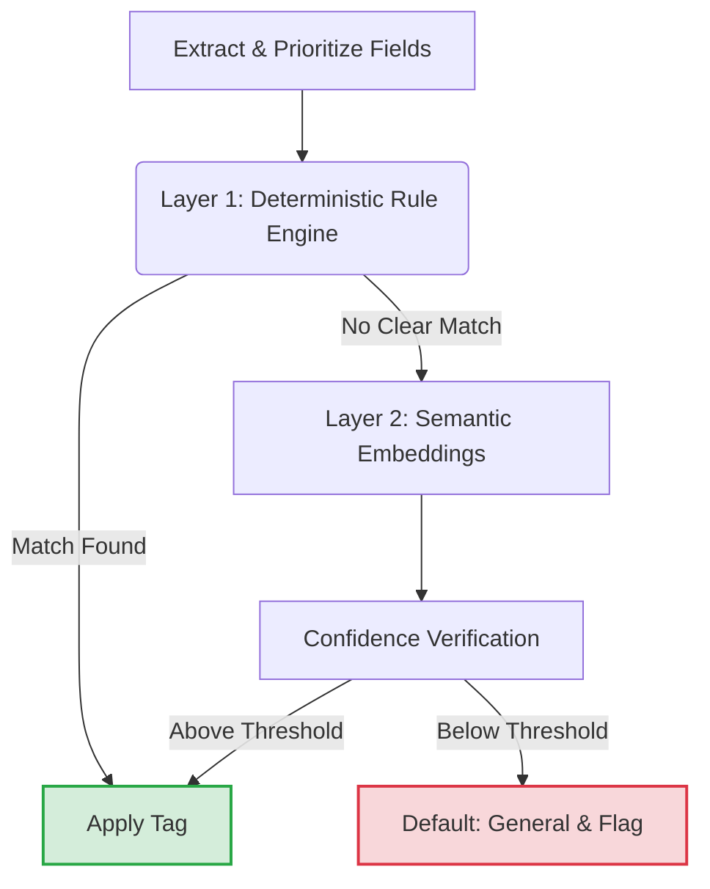

# Technical Project Report & Developer Documentation: Automated Ethnic Sector Classification Pipeline

---

## 1. Executive Summary & Intent

### Project Overview
This project introduces an automated data pipeline designed to parse, analyze, and classify funding request (FR) data. By extracting narrative indicators from grant descriptions, the system automatically populates **Ethnic Sectors** classifications against a standardized framework defined in `Taxonomy-Definitions.xlsx`.

### Developer Intent & Philosophy
This codebase was built with **modularity** and **extensibility** as core priorities. It aims to eliminate manual classification variance while remaining flexible enough for future developers to adjust rules as community demographic landscapes evolve. The architecture decouples strict deterministic business rules from probabilistic machine learning models, allowing developers to modify text matching patterns without breaking the underlying semantic search engine.

---

## 2. Core Architecture & Process Flow

The pipeline splits text execution into two distinct validation layers to balance rigid business constraints with nuanced human language.



### Step 1: Ingestion & Text Prioritization
The pipeline reads `FR Testing.xlsx` and builds a highly traversable hierarchical dictionary from `Taxonomy - Definitions.xlsx` using breadth-first search logic across three taxonomic depths. It then extracts text data sequentially based on data reliability:
1.  **Primary Focus:** `Final_Project_Description` & `Final_Summary_Description`
2.  **Secondary Context:** `Purpose`
3.  **Tertiary Reference:** `Funding Request Name`

### Step 2: Layer 1 – The Deterministic Rule Engine
The text is evaluated against known taxonomy terms. To prevent broad terms from overriding narrow terms, the script employs a **longer-match ranking system** (e.g., ensuring "Southern African" is successfully captured before defaulting to "African").

### Step 3: Layer 2 – Semantic Similarity Safety Net
If the rule engine fails to find an exact keyword match, the pipeline loads an embedding model to vectorize the text. It calculates nearest-neighbor classification against the taxonomy data, evaluating implicit semantic context (e.g., "supporting newcomers from the horn of Africa") and assigning a tag if it clears a set confidence threshold.

---

## 3. Granular Case Analysis

The business logic is built to handle 12 specific structural scenarios discovered in the funding request data:

| Case | Category | Analytical Approach | Operational Example |
| :--- | :--- | :--- | :--- |
| **Case 1** | **Exact Match** | Direct keyword alignment with deepest taxonomy terms (Level 3). | "Somali youth", "Punjabi community", "Cree families" |
| **Case 2** | **Level 2 Match** | Text aligns directly with a subregional classification. | "East African Students", "South Asian Population" |
| **Case 3** | **Level 1 Match** | Text aligns only with a broad continental category. | "African Communities", "Asian Families" |
| **Case 4** | **Structured Phrase** | Handles predictable "Modifier + Parent" patterns missing from standard taxonomy text. | "South African", "West African", "North African" |
| **Case 5** | **Taxonomy Country** | Matches country or nationality demonyms explicitly documented in the taxonomy. | "Kenyan", "Ethiopian", "Haitian" |
| **Case 6** | **Non-Taxonomy Country** | Processes valid demonyms that are missing from the raw reference data sheet. | "Jamaican", "Trinidadian", "Brazilian" |
| **Case 7** | **Country Structure** | Parses explicit country names structured inside broader narrative phrases. | "People from Jamaica", "Youth from India" |
| **Case 8** | **Multiple Groups** | Identifies overlapping ethnic cohorts, routing them to multi-group resolution logic. | "African and Caribbean youth", "Somali and Ethiopian Families" |
| **Case 9** | **Broad Identity Labels** | Maps overarching social, racial, or cultural descriptors. | "Black youth", "Arab communities", "Jewish population" |
| **Case 10** | **Organization Lookup** | Fallback validation that cross-references known organization names to infer identities. | A curated known-org name $\rightarrow$ North American Indigenous Origins |
| **Case 11** | **Grassroots Markers** | Evaluates secondary keywords to separate environmental grassroots initiatives from ethnic ones. | "Grassroots" + ethnic keywords indicates ethnic origin; else matches to General |
| **Case 12** | **General / Catch-all** | Fallback destination when no ethnic signals exist or prior cases are completely exhausted. | "All communities", "Open to everyone" |

---

## 4. Advanced Governance & Audit Flagging

To support a reliable automated environment, the pipeline features robust contextual governance to handle linguistic nuances and flags specific terms for manual human verification.

### Context Override (Historical vs. Active Targets)
Organizations frequently describe their historical roots alongside their current expanding mission. The script actively looks for scope shifts to avoid misclassifying the current target audience:
* **Historical Anchors Detected:** `Historically`, `Formerly`, `Previously`, `Originally`, `Used to serve`, `Once`, `Founded`, `Established`, `Was`, `Were`.
* **Scope Expansion Signals:** `Expanding beyond`, `Expansion`, `Beyond its...`, `Regardless of ethnic background`, `Irrespective of...`.
* *Action:* When both anchors occur in sequence, the engine overrides the historical classification in favor of the newly expanded demographic target.

### High-Priority Audit Flags

> [!IMPORTANT]
> **Transparency Rule:** Whenever an audit flag is triggered, the system preserves the exact phrase targeted and outputs it directly into the **Classification Flag Notes** section for human review.

* **BIPOC & Intersections:** Terms like `BIPOC`, `QTBIPOC`, `BPOC`, and `People of Colour` are carefully isolated. If paired with specific groups (e.g., "BIPOC and Asian"), the engine reviews the project's broad purpose to determine if it should scale to a multi-ethnic classification.
* **Ethnocultural Normalization Rules:**
    * `Black Canadian` / `African Canadian` $\rightarrow$ Standardized to **Other, Black** with an audit flag.
    * `Black Francophones` $\rightarrow$ Mapped to **Other, Black** with a specific `Francophone` language flag.
    * `Afro-Caribbean` $\rightarrow$ Correctly consolidated into **Multiple Ethnic Groups** (resolving both Black & Caribbean origins).
    * `Cultural Associations` $\rightarrow$ Any instance (e.g., "Kerala Cultural Association") flags the underlying specific regional origin (India).
* **Implicit General Signals:** Descriptors like `Marginalized`, `Multicultural`, `Ethnocultural`, `Racialized`, `Grassroots`, `Immigrant`, or `Refugee` lacking specific ethnic qualifiers default to **General Population**, but explicitly trigger an audit flag for data verification.
* **Geographical Indigenous Vectors:** Narrative markers referencing `Treaty 6`, `Treaty 7`, or `Treaty 8` bypass standard text rules and route directly to **North American Indigenous Origins** with an active verification flag.

---

## 5. Developer Onboarding & Extensibility Guide

If you are a developer looking to build upon or modify this codebase, use the breakdown below to understand where code adaptations should take place.

### Codebase Architecture
* `ethnic_taggerv3.py`: The production pipeline entry point. Contains file I/O operations, text field sequencing, the primary evaluation loop, and output generation.
* `diagnose_semantic_scores.py`: A utility script used to isolate Layer 2 performance. Use this to test sample text data against your embedding models without writing output modifications back to the main spreadsheets.

### How to Extend the Code

#### 1. Modifying or Adding a Rule Engine Case (Layer 1)
To introduce a new case condition or alter how text matching handles patterns:
* Locate the case breakdown functions inside `ethnic_taggerv3.py`.
* Rules are evaluated sequentially. If you introduce a brand new Case structure, ensure it is added to the loop check *prior* to Case 12 (General/Catch-all) to ensure text does not pre-maturely fall through.

#### 2. Tuning the Semantic Safety Net (Layer 2)
The semantic matcher translates text blocks into vectors using a local embedding model. 
* **Adjusting the Confidence Threshold:** Locate the similarity score evaluation condition within the script. If you find that the pipeline is falsely categorizing ambiguous text, raise the score threshold parameter. This forces weak matches to fallback to `General Population` while logging an audit flag.
* **Swapping the Embedding Model:** Locate where the vector model is instantiated. You can swap out the model string to point to a different pre-trained semantic vector space depending on your hardware or accuracy needs.

#### 3. Updating Logging and Flag Verbosities
To add more descriptive language to the flag output logs:
* Navigate to the flagging conditions inside the rule engine block.
* Modify the string allocation variable tied to the `Classification Flag Notes` metadata arrays. Ensure the targeted phrase token is always concatenated to preserve contextual transparency for auditors.

---

## 6. Technical Execution Guide

Run these files from your system terminal. The scripts take **no command-line
arguments** — they read/write fixed paths under the repo root:
`Taxonomy/Taxonomy - Definitions.xlsx` and `Data Sheets/FR testing.xlsx`
(sheet `Discretionary Funding Requests`). Place `FR testing.xlsx` in a
`Data Sheets/` folder at the repo root before running.

### Step A: Verify Vector Embedding Strengths
Run the semantic diagnostic script to analyze similarity scores and review confidence thresholds before running full production records:

```bash
python Engine_1_and_2/Semantic_Engine/diagnose_semantic_scores.py
```

### Step B: Run Classification Pipeline
Run the full pipeline to execute both engines — ethnic (+ semantic fallback) and
gender/sexual — applying the logic cases and writing classifications plus flag
notes back into `Data Sheets/FR testing.xlsx`:

```bash
python Engine_1_and_2/run_all.py
```

This runs `ethnic_taggerv3.py` (ethnic + `Semantic Suggestion (REVIEW)` columns)
followed by `Gender_SexID.py` (gender + sexual columns). To run an engine on its
own instead:

```bash
python Engine_1_and_2/Pipeline/ethnic_taggerv3.py   # ethnic only
python Engine_1_and_2/Pipeline/Gender_SexID.py      # gender + sexual only
```

> Note: running only `ethnic_taggerv3.py` leaves the gender/sexual columns (`Gender Id - FR9`, `Sexual Id - FR10`, and their flags) unpopulated — use:
> `run_all.py` for a complete output.