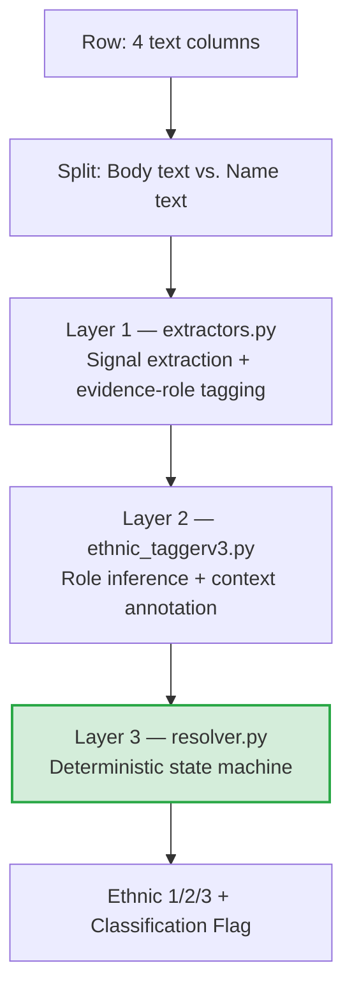

# Technical Project Report & Developer Documentation: Automated Ethnic, Gender & Sexual Identity Classification Pipeline

---

## 1. Executive Summary & Intent

### Project Overview
This project is an automated data pipeline that parses, analyzes, and classifies funding request (FR) data. By extracting narrative indicators from grant descriptions, the system populates three classification axes against the standardized frameworks in `Taxonomy - Definitions.xlsx`:

1. **Ethnic & Cultural Origins** (`Ethnic 1/2/3 - FR6/7/8`)
2. **Gender Identity** (`Gender Id - FR9`)
3. **Sexual Identity** (`Sexual Id - FR10`)

Every classification is accompanied by a **Classification Flag** column that preserves the evidence and any review notes for human auditors.

### Developer Intent & Philosophy
The codebase is built for **modularity**, **determinism**, and **auditability**. It eliminates manual classification variance while staying flexible enough to adjust rules as community demographic landscapes evolve.

The central design decision is a **strict separation between signal detection and decision-making**. Extractors are "dumb sensors" that surface every possible match; a single deterministic **state-machine resolver** makes every classification decision. No probabilistic model is in the shipping path — machine-learning components exist in the tree but are **hibernated / advisory-only** (see ->6). This keeps the engine fully reproducible and testable: the same row always produces the same label, and every decision can be traced to a rule.

---

## 2. Core Architecture & Process Flow

The ethnic engine is a **three-layer deterministic pipeline**. Each layer has one job and does not reach into the others:



Orchestration lives in `classify_pipeline.py`, which contains **no classification logic** — it only wires the layers together. All ethnic-origin decisions live in `resolver.py`.

### Step 1 — Ingestion & Text Prioritization
The pipeline reads the active dataset's workbook (see ->7 — dataset switching) and builds a hierarchical taxonomy dictionary from `Taxonomy - Definitions.xlsx`, parsing column D **"All Terms"** (Level 1 + Level 2 + Level 3 concatenated with the literal word `Origins` as delimiter), falling back to the individual Level 1/2/3 columns if that cell is blank. Entries are sorted **deepest-first, then longest-keyword-first** so that "Southern and East African" is captured before the broader "African".

The four input columns are split into two groups:

| Group | Columns | Role |
| :--- | :--- | :--- |
| **Body** (served-population evidence) | `Final_Project_Description`, `Final_Summary_Description`, `Purpose` | A signal here can classify a row. |
| **Name** (organization / request title) | `Funding Request Name` | Consulted only for a curated known-org lookup and to decide whether a *name-only* signal should be flagged. |

**Corroboration rule:** a signal must appear in the **body** to classify. A signal that appears **only in the name** degrades to `General Population` with an explanatory flag — unless a curated known-org lookup or the silent-body name rule applies (see ->4).

### Step 2 — Layer 1: Signal Extraction (`extractors.py`)
Six extractor functions scan the text and emit **one candidate per occurrence** of a match. They perform **no filtering, no negation guards, and no suppression** — every match becomes a candidate:

- `extract_taxonomy_candidates` — direct taxonomy keyword hits (Cases 1–3)
- `extract_pattern_candidates` — structured/directional phrases, e.g. "North African", "South Asian", plus Indigenous terms (Case 4)
- `extract_country_candidates` — demonyms and "from &lt;country&gt;" phrasing via the supplementary country map (Cases 6–7)
- `extract_compound_candidates` — dual-identity phrases like "Afro-Caribbean" (expands into two group candidates)
- `extract_broad_identity_candidates` — broad labels like "multiracial", "mixed heritage" (Case 9b)
- `extract_org_candidates` — curated known-organization lookup (Case 10, name-only, last resort)

Each candidate carries `{level1, level2, level3, depth, source, role, self_id, span, context}`.

### Step 3 — Layer 2: Evidence-Role Inference & Context Annotation (`ethnic_taggerv3.py`)
This is the heart of the current engine. Every extracted match is assigned an **evidence role** based on the words immediately surrounding it (`infer_role`). The role decides whether a match counts as real evidence of who is served:

| Role | Meaning | Counts as served? |
| :--- | :--- | :--- |
| `served` | Default — the group is stated as the served population. | ✅ Yes |
| `served_self_id` | Group counts as served only because the org named/described **itself** (org-name echo or copula self-description, e.g. "…is the only Indigenous Artist-Run Centre"). Normalized back to `served` but tracked via `self_id=True` so the row is still flagged. | ✅ Yes (flagged) |
| `topic_keep` | *(Indigenous-only)* Indigenous knowledge/art/practice used as program content, or an Indigenous nation named as an active partner. Kept as served, but adds a verify flag when no plain-served mention also exists. | ✅ Yes (flagged) |
| `org_name` | The term is a **third-party** organization's name ("in partnership with the &lt;Ethnicity&gt; Council"). | ❌ Weak |
| `provider` | The group is named as the service **provider**, not the recipient. | ❌ Weak |
| `example` | Mentioned as an example ("such as…", "including…"). | ❌ Weak |
| `aspirational` | Future/aspirational reach ("hoping to expand to…"). | ❌ Weak |
| `topic` | A curriculum topic, a story/festival setting, or an allyship/reconciliation frame — not a served population. | ❌ Weak |

**Key architectural invariant:** negation and historical/expansion framing are **NOT roles** — they never suppress a candidate. They are surfaced as *annotation flags only*, so a reviewer can judge them. This keeps classification decisions independent of soft discourse signals.

This layer also computes context signals (`extract_context_signals` → `build_context_notes`; production emits negation only), BIPOC detection (`is_bipoc_real_target`), identity-phrase rewrites (e.g. "African Canadian" → "black"), the silent-body name rule, and the Case 13 ethnocultural-org-name safety net.

### Step 4 — Layer 3: The Resolver State Machine (`resolver.py`)
A single deterministic function, `resolve(states, context_flags, bipoc_present)`, makes **every** ethnic decision. Its constraints are strict: context flags may only be **appended** to the output flag string — they **never** influence which branch fires. Decision order:

1. **BIPOC present** → `Multiple Ethnic and Cultural Origins` (unless exactly one specific group is also named, in which case it classifies *as that group* with a low-priority verify note).
2. **No served candidates** → org-lookup fallback, else name a weak-only mention in a transparency note, else `General Population`.
3. **Black + Indigenous co-present** → BIPOC / `Multiple`; **Black + African** or **Black + Caribbean** → `Multiple`.
4. **Two or more distinct Level 1 groups** → `Multiple`.
5. **Single Level 1 group** → resolve to the **deepest level all candidates agree on** (L3 → L2 → L1), dropping bare-umbrella entries when a specific sub-group exists. Indigenous umbrella + two-or-more distinct sub-groups rolls up to L1 with a review flag.

A crucial helper, `dedup()`, collapses candidates that resolve to the same (L1, L2, L3) and performs **evidence-role rescue**: if *any* occurrence of a group was `served`, that group counts as served even if other occurrences were weak.

---

## 3. Granular Case Analysis

The business logic handles these structural scenarios discovered in the funding-request data:

| Case | Category | Analytical Approach | Operational Example |
| :--- | :--- | :--- | :--- |
| **Case 1** | **Exact Match** | Direct keyword alignment with deepest taxonomy terms (Level 3). | "Somali youth", "Punjabi community", "Cree families" |
| **Case 2** | **Level 2 Match** | Text aligns with a subregional classification. | "East African students", "South Asian population" |
| **Case 3** | **Level 1 Match** | Text aligns only with a broad continental category. | "African communities", "Asian families" |
| **Case 4** | **Structured Phrase** | "Modifier + Parent" directional patterns missing from taxonomy text. | "South African", "West African", "North African" |
| **Case 5** | **Taxonomy Country** | Country/nationality demonyms present in the taxonomy. | "Kenyan", "Ethiopian", "Haitian" |
| **Case 6** | **Non-Taxonomy Country** | Valid demonyms absent from the taxonomy, resolved via the country map. | "Jamaican", "Trinidadian", "Brazilian" |
| **Case 7** | **Country Structure** | Explicit country names inside narrative phrases. | "People from Jamaica", "Youth from India" |
| **Case 8** | **Multiple Groups** | Distinct L1 (or tied L2) cohorts → `Multiple`. Same-L1 groups collapse to the shared level. | "African and Caribbean youth" → Multiple; "Indian and Pakistani" → South Asian |
| **Case 9** | **BIPOC (context-aware)** | BIPOC alone → Multiple; BIPOC + one group → that group (flagged). | "BIPOC and Asian" |
| **Case 9b** | **Broad Identity Labels** | Overarching social/cultural descriptors → Other Ethnic and Cultural Origins. | "multiracial", "mixed heritage" |
| **Case 10** | **Organization Lookup** | Curated known-org name → inferred identity; last resort, name-only. | Curated Indigenous-serving org → North American Indigenous Origins |
| **Case 11** | **Ambiguous Equity Markers** | "Grassroots"/"marginalized"/"racialized"/"multicultural" never classify alone; caller flags either way. | "grassroots" + ethnic keyword vs. bare "grassroots" |
| **Case 12** | **General / Catch-all** | Fallback when no served ethnic signal exists. | "All communities", "Open to everyone" |
| **Case 13** | **Ethnocultural Org Name (safety net)** | Low-recall, high-precision: only fires when a row would otherwise be General with zero candidates; flags a possible ethnocultural org name in the title. **Never classifies** — review flag only. | An unrecognized "&lt;Group&gt; Cultural Society" in the title |

---

## 4. Advanced Governance & Audit Flagging

### Name-vs-Body Corroboration & the Silent-Body Name Rule
Because a signal must be corroborated in the body, a row whose **body carries no served signal** is handled specially:

- **Known org** in the name → curated lookup classifies it.
- Otherwise, the **silent-body name rule** (`classify_from_raw_name`) reads identity terms from the raw account name — but only when the body genuinely names no population on *any* axis (`body_names_a_population` guard) and no identity-expansion disclaimer is present. Religion-only or language-only names ("Islamic Missionary Association", "French Canadian Association") resolve to General with a targeted note rather than guessing an ethnicity.
- A name-derived classification is **always flagged** (`SILENT_NAME_FLAG` / `SELF_ID_FLAG`) so a reviewer knows the label was inferred from the org's identity, not stated.

### Self-Identification
An ethnicity-named org naming its **own** ethnicity is treated as evidence of who it serves (`served_self_id`), including orgs named in an Indigenous language that describe themselves ("…is the only Indigenous Artist-Run Centre"). Third-party org names ("in partnership with the &lt;Ethnicity&gt; Council") are still demoted.

### Context Override (Historical vs. Active Targets)
The engine detects historical anchors (`Historically`, `Formerly`, `Previously`, `Originally`, `Founded`, `Established`, `Was/Were`, …) and scope-expansion signals (`Expanding beyond`, `Regardless of ethnic background`, `Irrespective of…`). These are **annotation-only** — they surface a flag but, per the architectural invariant, never suppress a candidate on their own. They demote a match only indirectly, when they coincide with an org-name echo.

### French / Language-Accommodation Filter
When text signals language accommodation ("french-speaking", "in French and English", "official-language minority", "francophone") **and** does not match an ethnic keep-pattern ("French Canadian Association", "Francophone Cultural Society"), French/European ethnic candidates are dropped and a verify note is added — preventing spurious `Multiple` when language access co-occurs with a real ethnic group.

### High-Priority Audit Flags

> [!IMPORTANT]
> **Transparency Rule:** Whenever a flag is triggered, the system preserves the targeted phrase/evidence and writes it into the **Classification Flag** column for human review.

- **BIPOC & Intersections:** `BIPOC`, `QTBIPOC`, `BPOC`, `People of Colour` are context-checked (example/negation/"the BIPOC Grant" program-name uses are skipped). BIPOC alongside exactly one specific group classifies as that group with a low-priority note.
- **Ethnocultural Normalization (identity-phrase rewrites):** `Black Canadian` / `African Canadian` → normalized so downstream matching handles them consistently; `Afro-Caribbean` → `Multiple` (Black + Caribbean); `Cultural Association` mentions are flagged ("verify named group manually").
- **Implicit General Signals:** `Marginalized`, `Multicultural`, `Ethnocultural`, `Racialized`, `Grassroots`, `Immigrant`, `Refugee` without a specific ethnic qualifier default to `General Population` but trigger an audit flag.
- **Indigenous:** general Indigenous terms and Treaty 6/7/8 markers route to `North American Indigenous Origins`. The engine deliberately **over-flags** Indigenous mentions (topic_keep, umbrella-vs-sub-group ambiguity) rather than risk a silent miss.
- **Emphasis & Religion cues:** "especially"/"particularly" near a matched group, and "Hindu" (may imply South Asian/Indian), are surfaced as verify notes on non-General rows.

---

## 5. The Gender & Sexual Identity Engines

`Gender_SexID.py` adds two more axes, reusing the same body/name split and text helpers from `ethnic_taggerv3.py`:

- **Gender Identity** (`Gender Id - FR9` + `Gender Classification Flag`): extracts gender terms from the body; `0` keys → General, `1` → that group (Women/Girls, Men/Boys, Two-Spirit, Other), `2+` → Multiple Gender Identities. A name-only signal degrades to General + org-name flag.
- **Sexual Identity** (`Sexual Id - FR10` + `Sexual Classification Flag`): any guarded body signal → `2SLGBTQIA+`, else General.

Both share the silent-body name rule and family-context guards (so an incidental "fathers"/"sons" mention doesn't misclassify). All labels, patterns, and flag strings live in `gender_constants.py`.

---

## 6. Machine Learning: Hibernated / Advisory-Only

> [!WARNING]
> **The ML layers are NOT in the shipping classification path.** The deterministic rule engine is the sole authority on every label.

Two ML/semantic components exist but do not decide classifications:

1. **Semantic taxonomy suggestion** (`Semantic_Engine/semantic_fallback.py`): a local sentence-embedding model (MiniLM) that, **only for rows the deterministic engine resolved to `General Population`**, suggests the nearest taxonomy entry above a similarity+margin threshold. It never overrides or auto-writes an `Ethnic 1/2/3` result, because embeddings don't understand negation or context override. **Archived 2026-07-29:** this path is no longer imported or run by the pipeline — `ethnic_taggerv3` no longer wires it in and writes no semantic column; `semantic_fallback.py` remains under `Semantic_Engine/` for reference only.

    > **Column note:** the review column this originally populated (`OUTPUT_SEMANTIC = "Semantic Suggestion (REVIEW)"` in code) was manually repurposed in the workbook into a human-review/correction column titled **"Classification Accuracy (Corrected in Different Areas)"**. The engine now *reads* that same column as its **stakeholder-reviewed gate** (`STAKEHOLDER_REVIEWED_COL`): any row a human has marked there is skipped by the NLI role arbiter so it can never second-guess a human-confirmed decision. (The old `OUTPUT_SEMANTIC` constant and its column-write were removed when the semantic path was archived, so nothing re-creates the old header anymore.)

2. **NLI role arbiter** (`Semantic_Engine/ml_arbiter.py`, wired in `classify_pipeline.apply_ml_role_arbiter`): a vendored cross-encoder that can offer a second opinion on `served` role frames. It is **off by default** (`USE_ML_ROLE_ARBITER=1` to A/B test), is **advisory-only** (attaches a verify note, never changes `role` or any label), and skips stakeholder-reviewed rows entirely.

The ML training/calibration scripts have been archived (`Auditing/archive/`). Requirements for the ML layer are isolated in `requirements-ml.txt`; the default `requirements.txt` excludes them to keep the install lean.

---

## 7. Codebase Architecture & Extensibility Guide

### Module Map
```
Engine_1_and_2/
├── run_all.py                 # Single entry point — runs all engines in order
├── bootstrap.py               # sys.path setup, dataset resolution, UTF-8 stdout
├── dataset_config.py          # Which dataset the engine runs on (see below)
├── Pipeline/
│   ├── classify_pipeline.py   # Orchestration only — wires the 3 layers
│   ├── extractors.py          # Layer 1 — signal extraction + role tagging
│   ├── ethnic_taggerv3.py     # Layer 2 — role inference, context, I/O, main()
│   ├── resolver.py            # Layer 3 — deterministic state machine (all decisions)
│   └── Gender_SexID.py        # Gender + sexual identity engines
├── Constants/
│   ├── constants.py           # Ethnic patterns, country map, org map, phrase lists
│   └── gender_constants.py    # Gender/sexual labels, patterns, flags
├── Semantic_Engine/           # Advisory/hibernated ML (see ->6)
└── Auditing/                  # Regression, review reports, stakeholder dashboard
```

### Dataset Switching
`dataset_config.py` is the single source of truth for which workbook the engine runs on. Change `ACTIVE_DATASET`, or set the `ECF_DATASET` environment variable for a one-off run. Each dataset entry defines its raw/output workbooks, data sheet, and taxonomy sheet. Current datasets: `2025` (default) and `2023_24`.

### How to Extend

**1. Add or modify a rule (Layer 1 data).** Most rules are data, not code: edit the relevant list/map in `Constants/constants.py` (`PATTERN_RULES`, `COUNTRY_REGION_MAP`, `ORG_NAME_ETHNICITY_MAP`, `BROAD_IDENTITY_KEYWORDS`, the role-frame phrase lists, etc.). The extractors pick these up automatically.

**2. Change a classification decision (Layer 3).** All decision logic is in `resolver.py`. Because context flags may never influence which branch fires, decisions stay deterministic and unit-testable in isolation (`test_classify_pipeline.py`).

**3. Add or refine an evidence role (Layer 2).** Roles are inferred in `ethnic_taggerv3.infer_role` from the surrounding-text phrase lists. Add a new frame by extending the matching `ROLE_*` pattern list; scope group-specific frames (like the Indigenous `topic_keep`) at the extractor call site where `level1` is known, to avoid cross-group collisions.

**4. Adjust flag verbosity.** Production notes are intentionally minimal to reduce reviewer fatigue (negation is the only context signal surfaced by default; the rest are available via `build_debug_context_notes`). Flag text is assembled in `resolver.build_output` / `source_flag` and in `classify_pipeline.classify_row`.

> [!IMPORTANT]
> **Regression discipline:** any engine change should be re-run against the full audited dataset and its output compared against the gold standard before it ships. See `Auditing/regression_audited_rows.py` and `regression_baseline.json`.

---

## 8. Technical Execution Guide

The scripts take **no command-line arguments** — they read/write the fixed paths defined by the active dataset in `dataset_config.py`. Place the data workbook under `Data Sheets/` and the taxonomy under `Taxonomy/` at the repo root before running.

### Recommended: Full Pipeline
Runs ethnic → gender → sexual in order and writes all columns into the active dataset's workbook:

```powershell
python Engine_1_and_2/run_all.py
```

(`bootstrap.py` reconfigures stdout to UTF-8, so no env vars are needed. No ML models load — the pipeline is fully deterministic.)

### Run an Engine Individually
```powershell
python Engine_1_and_2/Pipeline/ethnic_taggerv3.py   # ethnic columns
python Engine_1_and_2/Pipeline/Gender_SexID.py      # gender + sexual columns
```

> Note: running only `ethnic_taggerv3.py` leaves the gender/sexual columns (`Gender Id - FR9`, `Sexual Id - FR10`, and their flags) unpopulated. Use `run_all.py` for a complete output.

### One-off Dataset Override
```powershell
$env:ECF_DATASET="2023_24"; python Engine_1_and_2/run_all.py
```

### Optional Diagnostic (embedding thresholds)
```powershell
python Engine_1_and_2/Semantic_Engine/diagnose_semantic_scores.py
```

### Output Columns Written
| Axis | Columns |
| :--- | :--- |
| Ethnic | `Ethnic 1 - FR6`, `Ethnic 2 - FR7`, `Ethnic 3 - FR8`, `Classification Flag` |
| Gender | `Gender Id - FR9`, `Gender Classification Flag` |
| Sexual | `Sexual Id - FR10`, `Sexual Classification Flag` |
